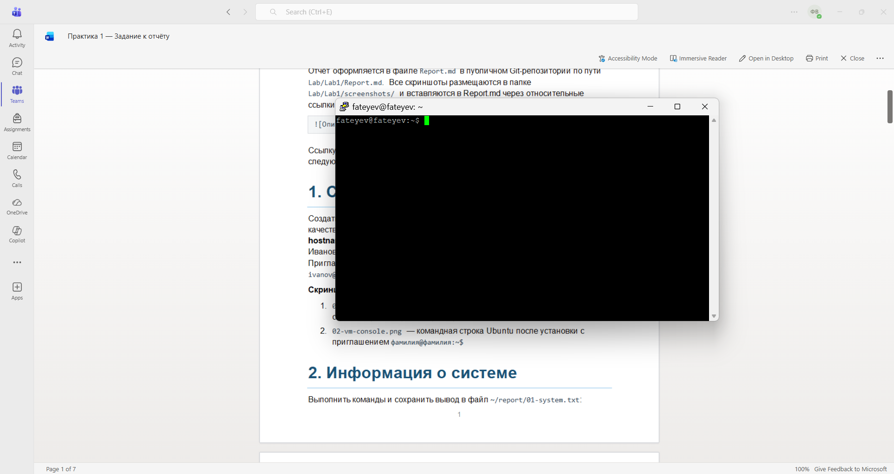
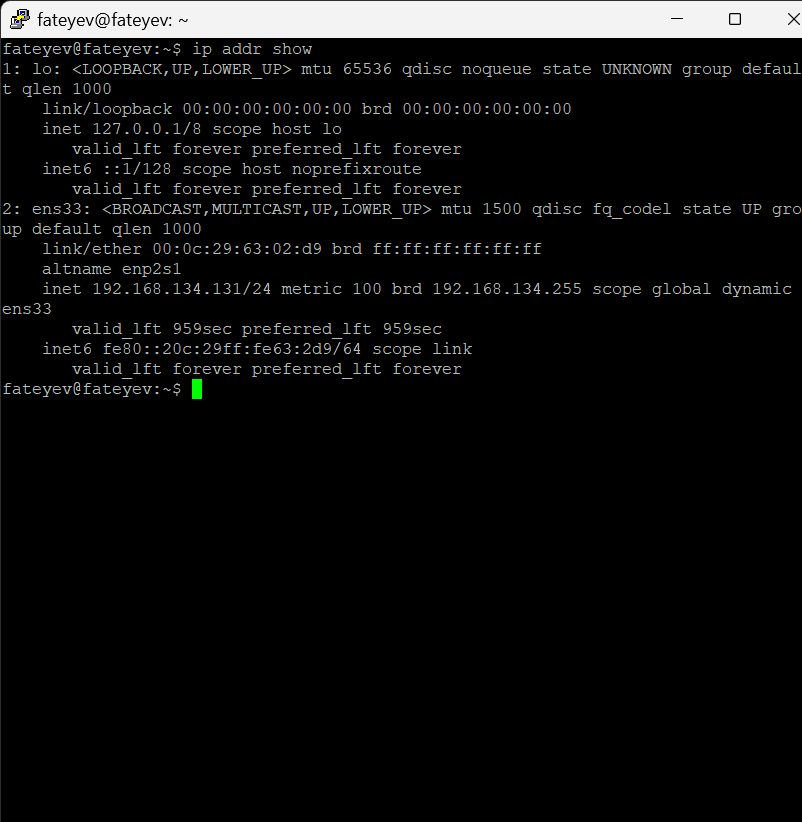
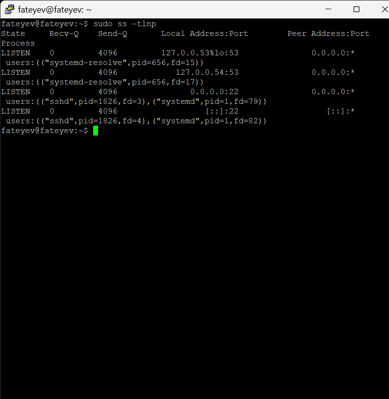
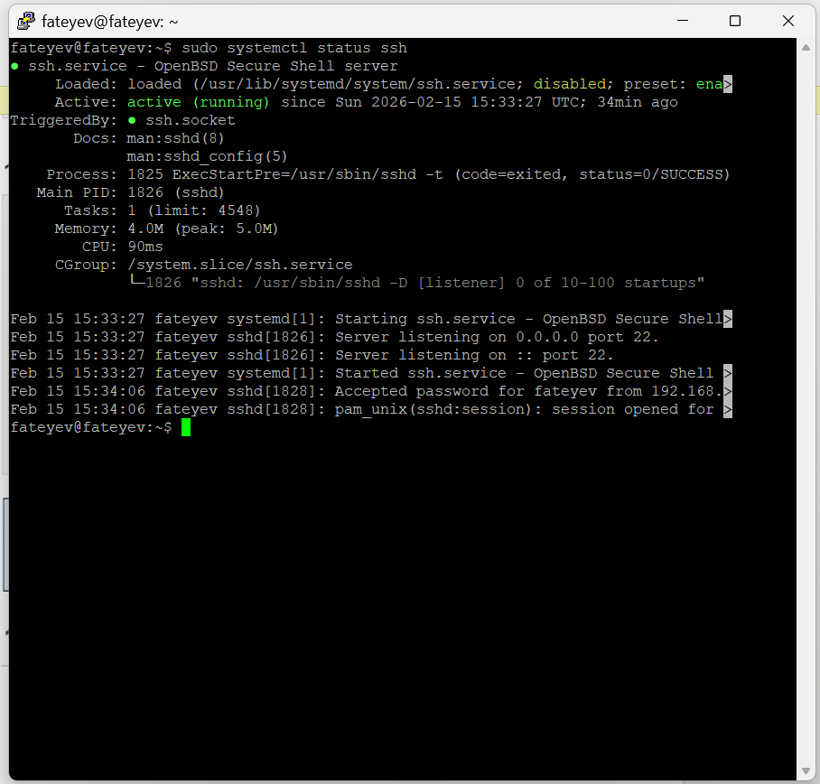
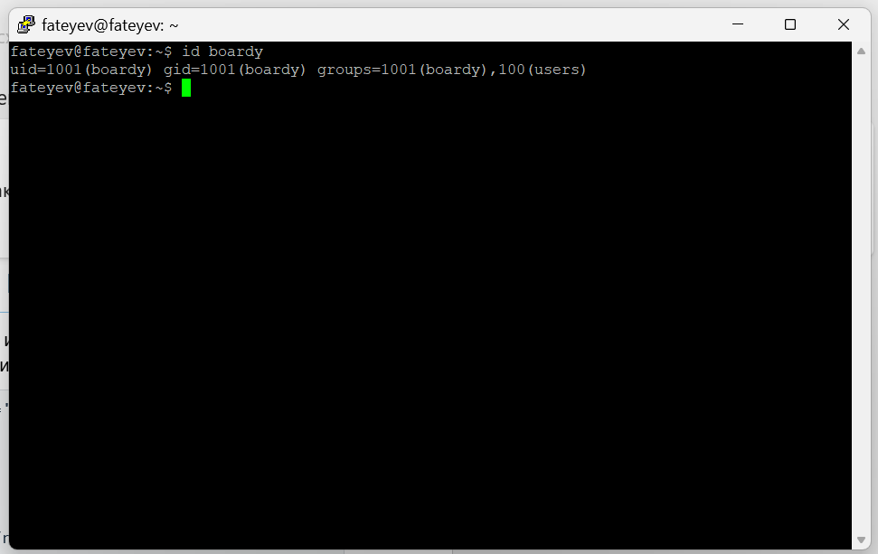
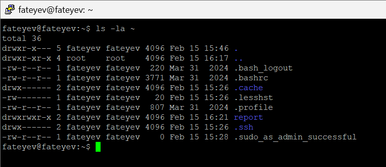
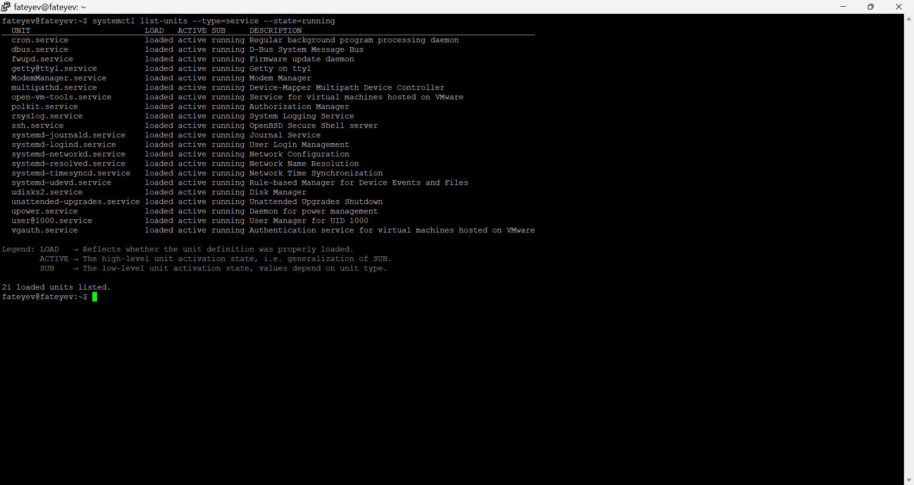
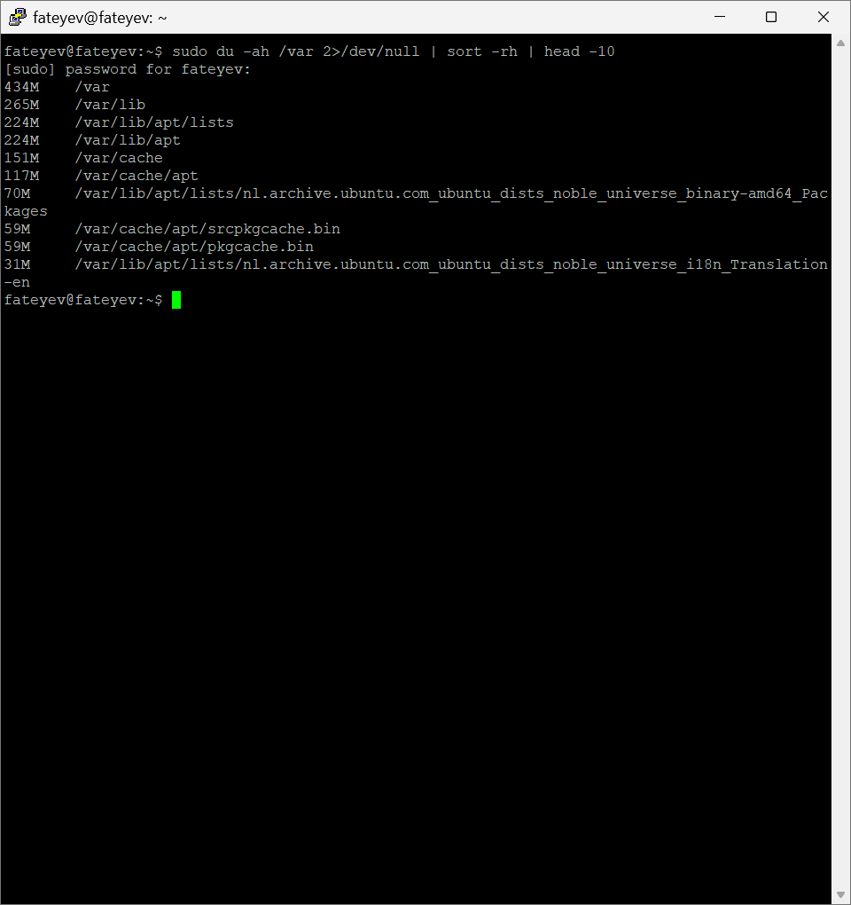

# Практическая работа №1: Основы командной строки Linux

## 1. Создание виртуальной машины

Создал виртуальную машину Ubuntu 22.04 в VMware Workstation Player. Указал имя ВМ `fateyev`, пользователя `fateyev`, hostname `fateyev`. Выделил 4 ГБ RAM, 20 ГБ диск.




## 2. Информация о системе

Собрал системную информацию в файл `01-system.txt`: `uname -a` (версия ядра), `cat /etc/os-release` (Ubuntu), `lscpu` (процессор), `free -h` (память), `df -h` (диски).

```
mkdir -p ~/report
echo '=== СИСТЕМА ===' > ~/report/01-system.txt
uname -a >> ~/report/01-system.txt
echo '' >> ~/report/01-system.txt
echo '=== ОС ===' >> ~/report/01-system.txt
cat /etc/os-release >> ~/report/01-system.txt
echo '' >> ~/report/01-system.txt
echo '=== ПРОЦЕССОР ===' >> ~/report/01-system.txt
lscpu | head -15 >> ~/report/01-system.txt
echo '' >> ~/report/01-system.txt
echo '=== ПАМЯТЬ ===' >> ~/report/01-system.txt
free -h >> ~/report/01-system.txt
echo '' >> ~/report/01-system.txt
echo '=== ДИСКИ ===' >> ~/report/01-system.txt
df -h >> ~/report/01-system.txt
```


## 3. Сеть: IP-адрес и открытые порты

Собрал сетевую информацию в `02-network.txt`: `ip addr show` (IP-адреса интерфейсов), `sudo ss -tlnp` (прослушиваемые порты с PID процессов).

```
echo '=== IP-АДРЕСА ===' > ~/report/02-network.txt
ip addr show >> ~/report/02-network.txt
echo '' >> ~/report/02-network.txt
echo '=== ОТКРЫТЫЕ ПОРТЫ ===' >> ~/report/02-network.txt
sudo ss -tlnp >> ~/report/02-network.txt
```




## 4. Сервис SSH

Проверил SSH-сервер: `sudo systemctl status ssh` (статус сервиса), `sudo ss -tlnp | grep ssh` (порт 22). SSH активен.

```
echo '=== СТАТУС SSH ===' > ~/report/03-ssh.txt
sudo systemctl status ssh >> ~/report/03-ssh.txt 2>&1
echo '' >> ~/report/03-ssh.txt
echo '=== ПОРТ SSH ===' >> ~/report/03-ssh.txt
sudo ss -tlnp | grep ssh >> ~/report/03-ssh.txt
```




## 5. Пользователи и группы

Собрал данные о пользователях в `04-users.txt`: `whoami`, `id` (текущий), `grep '/bin/bash' /etc/passwd` (с bash).

```
echo '=== ТЕКУЩИЙ ПОЛЬЗОВАТЕЛЬ ===' > ~/report/04-users.txt
whoami >> ~/report/04-users.txt
id >> ~/report/04-users.txt
echo '' >> ~/report/04-users.txt
echo '=== ПОЛЬЗОВАТЕЛИ С BASH ===' >> ~/report/04-users.txt
grep '/bin/bash' /etc/passwd >> ~/report/04-users.txt
echo '' >> ~/report/04-users.txt
echo '=== ВСЕ ПОЛЬЗОВАТЕЛИ ===' >> ~/report/04-users.txt
cut -d: -f1 /etc/passwd | sort >> ~/report/04-users.txt
echo '' >> ~/report/04-users.txt
echo '=== ГРУППЫ ===' >> ~/report/04-users.txt
groups >> ~/report/04-users.txt
```

Создал пользователя boardy: `sudo adduser boardy`, `sudo usermod -aG sudo boardy`.

```
sudo adduser boardy
sudo usermod -aG sudo boardy
id boardy
```




## 6. Дерево каталогов

Изучил файловую систему в `05-tree.txt`: `ls -la /` (корень), `ls -la /home` (домашние папки), `ls -la ~` (мой каталог).

```
echo '=== КОРЕНЬ ===' > ~/report/05-tree.txt
ls -la / >> ~/report/05-tree.txt
echo '' >> ~/report/05-tree.txt
echo '=== /home ===' >> ~/report/05-tree.txt
ls -la /home >> ~/report/05-tree.txt
echo '' >> ~/report/05-tree.txt
echo '=== ДОМАШНИЙ КАТАЛОГ ===' >> ~/report/05-tree.txt
ls -la ~ >> ~/report/05-tree.txt
```




## 7. Права доступа

Проверил права каталогов `ls -ld / /etc /var /tmp /home`. Создал `testfile.txt`, применил `chmod 755` (rwx|r-x|r-x), затем `chmod 600` (rw-|---|---).

```
echo '=== ПРАВА НА КАТАЛОГИ ===' > ~/report/06-permissions.txt
ls -ld / /etc /var /tmp /home >> ~/report/06-permissions.txt
echo '' >> ~/report/06-permissions.txt
echo '=== ИЗМЕНЕНИЕ ПРАВ ===' >> ~/report/06-permissions.txt
touch ~/report/testfile.txt
ls -l ~/report/testfile.txt >> ~/report/06-permissions.txt
chmod 755 ~/report/testfile.txt
ls -l ~/report/testfile.txt >> ~/report/06-permissions.txt
chmod 600 ~/report/testfile.txt
ls -l ~/report/testfile.txt >> ~/report/06-permissions.txt
```


## 8. Установленные пакеты и сервисы

Проверил ключевые пакеты `dpkg -l | grep 'openssh|python|git|curl|vim|nano'`, общее количество `dpkg -l | grep '^ii' | wc -l`, сервисы `systemctl list-units --type=service --state=running`.

```
echo '=== КЛЮЧЕВЫЕ ПАКЕТЫ ===' > ~/report/07-packages.txt
dpkg -l | grep -E 'openssh|python|git|curl|vim|nano' >> ~/report/07-packages.txt
echo '' >> ~/report/07-packages.txt
echo '=== КОЛИЧЕСТВО ПАКЕТОВ ===' >> ~/report/07-packages.txt
dpkg -l | grep '^ii' | wc -l >> ~/report/07-packages.txt
echo '' >> ~/report/07-packages.txt
echo '=== ЗАПУЩЕННЫЕ СЕРВИСЫ ===' >> ~/report/07-packages.txt
systemctl list-units --type=service --state=running >> ~/report/07-packages.txt
```




## 9. Конвейер и перенаправление

Анализ через конвейеры: `ps aux | sort | head` (топ по памяти), `ps aux | awk | sort | uniq -c` (процессы по пользователям), `du /var | sort | head` (большие файлы).

```
echo '=== ТОП-10 ПРОЦЕССОВ ПО ПАМЯТИ ===' > ~/report/08-pipes.txt
ps aux --sort=-%mem | head -11 >> ~/report/08-pipes.txt
echo '' >> ~/report/08-pipes.txt
echo '=== ПРОЦЕССЫ ПО ПОЛЬЗОВАТЕЛЯМ ===' >> ~/report/08-pipes.txt
ps aux | tail -n +2 | awk '{print $1}' | sort | uniq -c | sort -rn >> ~/report/08-pipes.txt
echo '' >> ~/report/08-pipes.txt
echo '=== БОЛЬШИЕ ФАЙЛЫ В /var ===' >> ~/report/08-pipes.txt
sudo du -ah /var 2>/dev/null | sort -rh | head -10 >> ~/report/08-pipes.txt
```




## 10. Итоговый файл

Объединил отчёты `cat ~/report/0*.txt > FULL-REPORT.txt`. Проверил файлы `ls -lh ~/report/` — создано 8 файлов + итоговый отчёт.

```
cat ~/report/0*.txt > ~/report/FULL-REPORT.txt
wc -l ~/report/FULL-REPORT.txt
ls -lh ~/report/
```

