# Лабораторная работа 10: Авторизация: куки и сессии

## Часть A. Подготовка и вёрстка

### Задание 1. Столбец password_hash
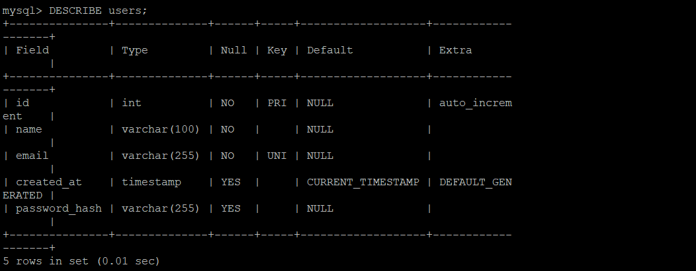

**Ответ:**  
`VARCHAR(255)` используется вместо `VARCHAR(60)` потому что:
- Bcrypt-хеш занимает 60 символов, но стандарты хеширования могут меняться
- Будущие алгоритмы (например Argon2) могут давать более длинные хеши
- `VARCHAR(255)` даёт запас на будущее без необходимости менять структуру таблицы

Если сделать `VARCHAR(50)`, то bcrypt-хеш (60 символов) не поместится — INSERT вызовет ошибку `Data too long for column`.

### Задание 2. Partials
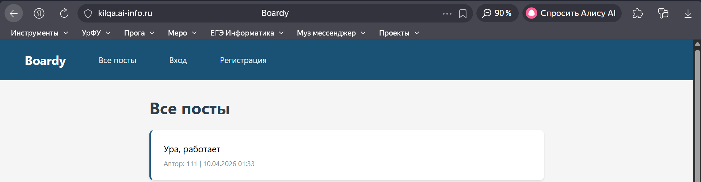
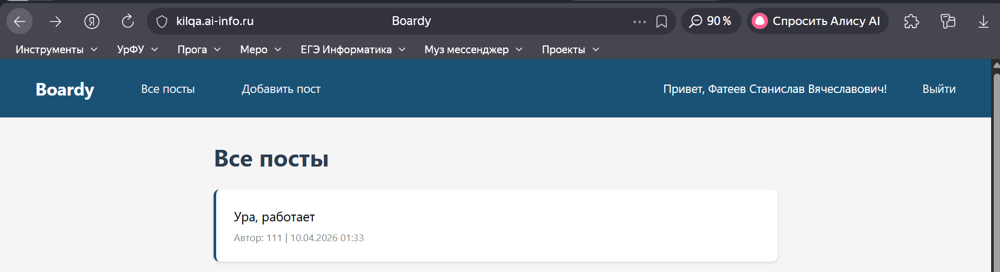

**Ответ:**  
Меню вынесено в отдельный файл `nav.php` для соблюдения принципа DRY (Don't Repeat Yourself). Меню подключается на всех страницах через `include`, и если нужно добавить новую ссылку (например «Избранное»), достаточно изменить один файл `nav.php`, а не править каждую страницу отдельно.

### Задание 3. Вёрстка форм по макетам
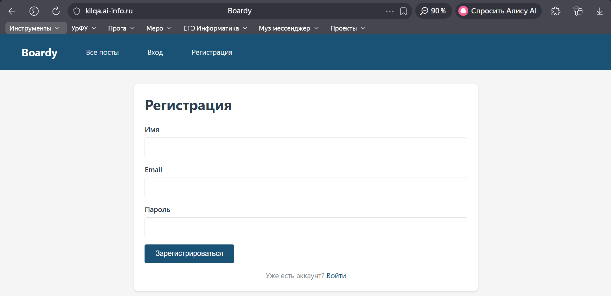
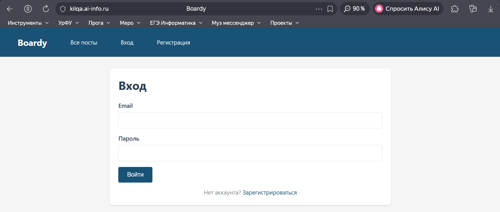


## Часть B. Регистрация и логин

### Задание 4. Регистрация


### Задание 5. Хеш в базе
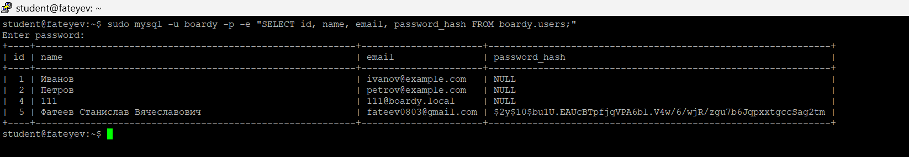

**Ответ:**  
Структура хеша `$2y$10$Kx8QnZq...`:
- `$2y$` — идентификатор алгоритма bcrypt
- `10` — cost factor (количество раундов: 2^10 = 1024 раунда)
- Остальное — соль (22 символа) + собственно хеш (31 символ)

Если увеличить cost factor с 10 до 15, хеширование станет медленнее (2^15 = 32768 раундов, что в 32 раза дольше). Это усложнит подбор паролей перебором, но увеличит время ответа сервера при логине.

### Задание 6. Защита от повторной регистрации
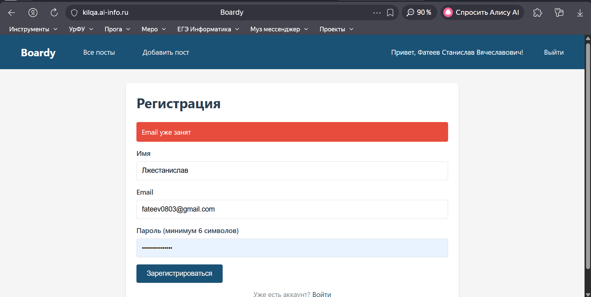

**Ответ:**  
Проверка email перед INSERT нужна, чтобы:
1. Показать пользователю понятное сообщение об ошибке
2. Избежать генерации исключения от UNIQUE-ограничения БД

Без этой проверки второй пользователь с тем же email вызовет ошибку `Duplicate entry` на уровне MySQL, и скрипт упадёт без понятного объяснения.

### Задание 7. Логин
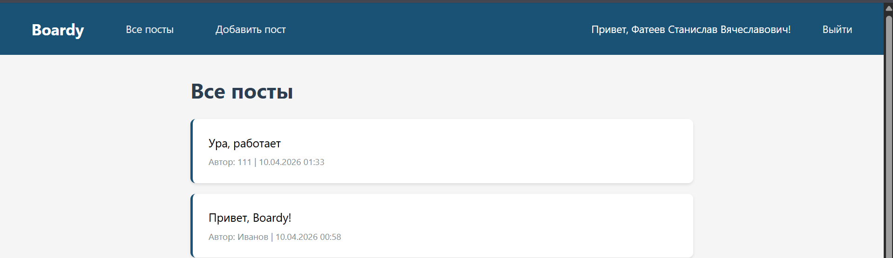

### Задание 8. Неверный пароль
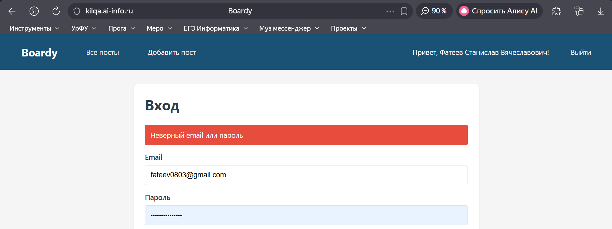

**Ответ:**  
Сообщение одинаковое для «email не найден» и «неверный пароль» по соображениям безопасности. Если бы сообщения различались, злоумышленник мог бы перебирать email'ы и по ответу сервера узнавать, какие email зарегистрированы в системе.


## Часть C. Куки и сессии

### Задание 9. Кука PHPSESSID
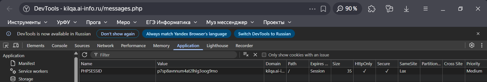

**Ответ:**  
В значении куки хранится случайный идентификатор сессии (например `ia7n66hsp03tc3rpbtpi1e8fqk`). Это НЕ пароль и НЕ имя пользователя, а просто уникальный ключ. Значение генерируется PHP при первом вызове `session_start()` и не содержит никакой информации о пользователе.

### Задание 10. Параметры куки


**Ответ:**  
Если убрать `HttpOnly`, то JavaScript получит доступ к куке через `document.cookie`. Это позволяет злоумышленнику при XSS-атаке украсть PHPSESSID, отправить его на свой сервер и войти в систему под чужим аккаунтом (session hijacking).

### Задание 11. HttpOnly на практике
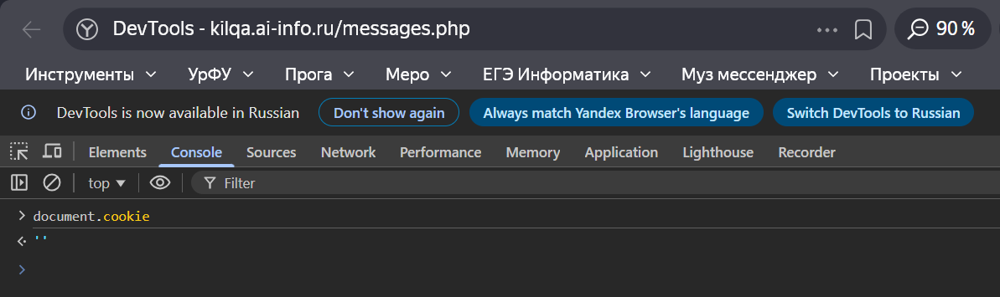

**Ответ:**  
PHPSESSID не видна в `document.cookie`, потому что кука отмечена флагом `HttpOnly`. Этот флаг говорит браузеру не отдавать куку JavaScript-коду, что защищает идентификатор сессии от кражи через XSS-атаки.

### Задание 12. Файл сессии на сервере
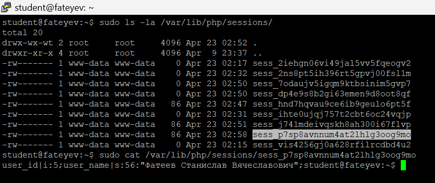

**Ответ:**  
В файле на сервере хранятся реальные данные пользователя: `user_id` и `user_name`. В куке — только случайный ID. Данные разделены для безопасности: если злоумышленник украдёт куку, он получит только ID, но не сможет узнать имя или другую информацию. Сами данные лежат на сервере, который злоумышленник не контролирует.


## Часть D. Защита и доработка

### Задание 13. Защита страниц
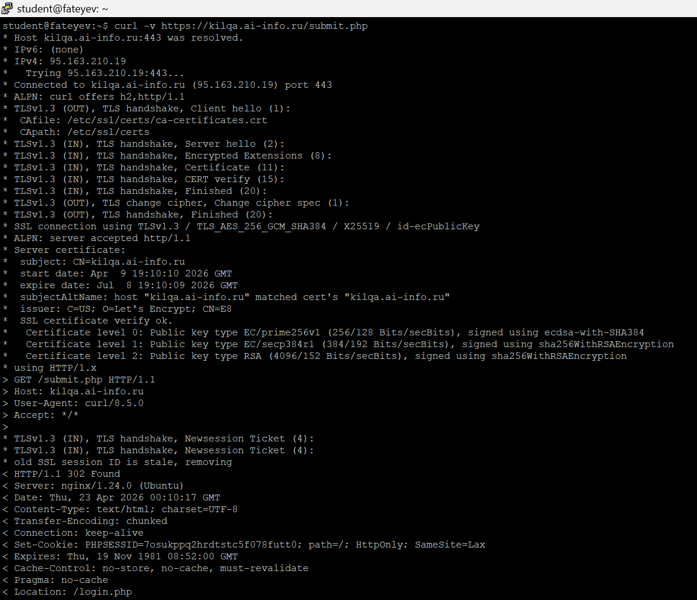

### Задание 14. Посты с автором
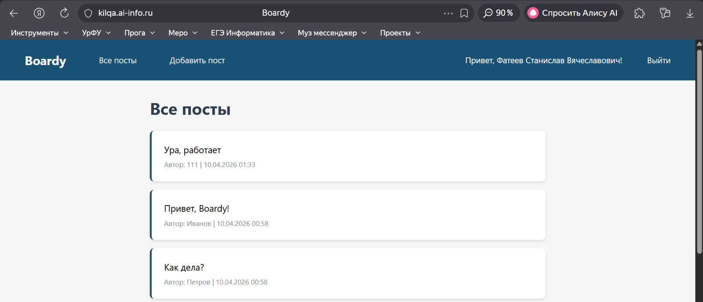

**Ответ:**  
SQL с JOIN:

```
SELECT p.id, p.body, p.created_at, u.name AS author_name
FROM posts p
JOIN users u ON p.author_id = u.id
ORDER BY p.created_at DESC
```

JOIN нужен, чтобы за один запрос получить и пост, и имя автора. Два отдельных запроса (сначала посты, потом для каждого author_id запрос к users) дали бы N+1 запросов, что медленнее и сложнее.

### Задание 15. Добавление поста
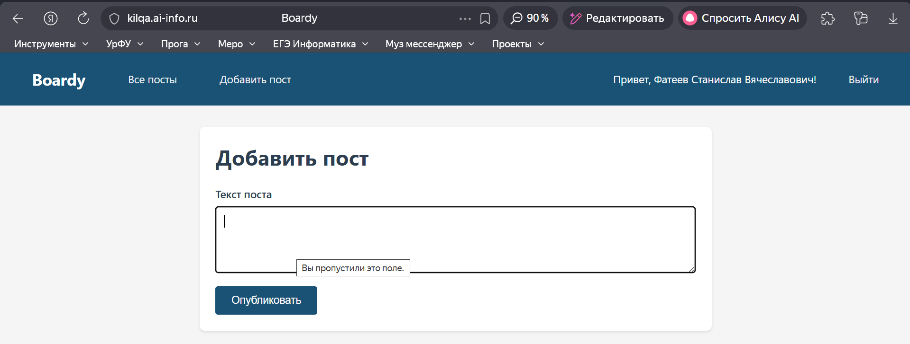

### Задание 16. Logout
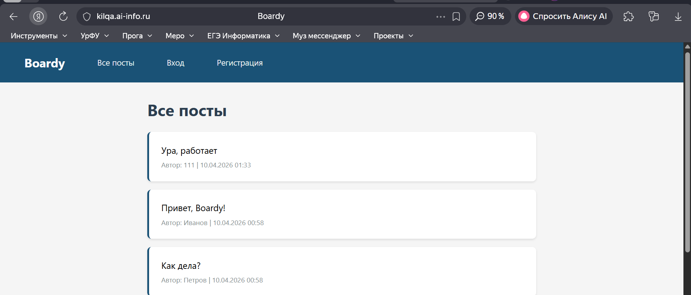
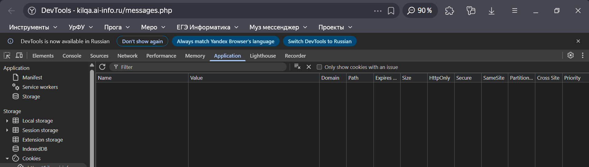

**Ответ:**  
- `session_destroy()` удаляет файл сессии на сервере
- `setcookie()` с прошедшей датой удаляет куку в браузере

Если сделать только `session_destroy()`: файл на сервере удалится, но кука в браузере останется → браузер будет отправлять несуществующий ID.  
Если сделать только `setcookie()`: кука удалится, но файл на сервере останется → «мусор» в папке сессий.

### Задание 17. Истёкшая сессия
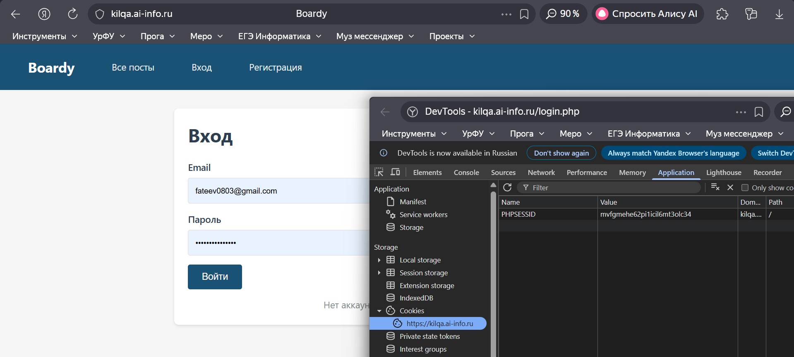

**Ответ:**  
Браузер считает себя залогиненным, потому что у него есть кука `PHPSESSID`. Сервер не находит файл с таким ID (он был удалён), поэтому не может восстановить `$_SESSION` и считает пользователя гостем. Кука и файл сессии — это связка «ключ-замок»: ключ есть, а замок сломали.
