# Лабораторная работа 11: JWT для API и OAuth через GitHub

## Часть A. JWT для API

### Задание 1. auth.py
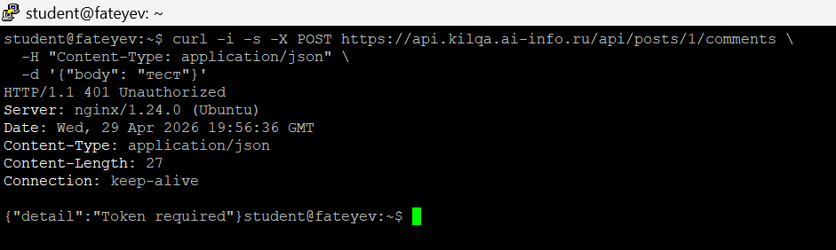

**Ответ:**  
«Bearer» в заголовке Authorization указывает на тип аутентификации. Формат: `Authorization: Bearer <token>`. Это стандарт OAuth 2.0, который позволяет серверу понять, что после слова Bearer идёт токен доступа. Если писать просто `Authorization: eyJ...`, сервер не сможет отличить токен от других возможных форматов (Basic, Digest и т.д.). Bearer означает «предъявитель» — кто владеет токеном, тот и авторизован.

### Задание 2. /api/me.php
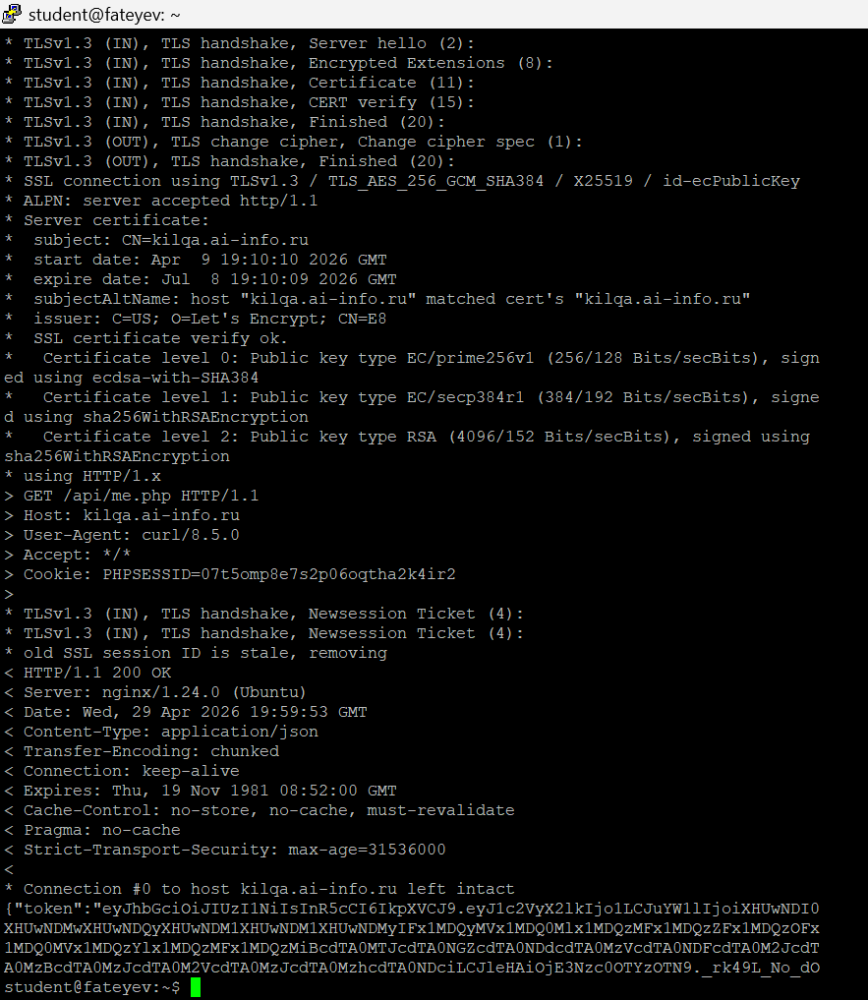

**Ответ:**  
`me.php` использует `session_start()`, потому что сессия — это единственный способ PHP понять, кто сделал запрос. Кука `PHPSESSID` идентифицирует сессию на сервере, по которой извлекается `user_id`. Логин/пароль не передаются, так как пользователь уже аутентифицирован через сессию. Кука автоматически прикрепляется браузером к каждому запросу к тому же домену.

### Задание 3. React получает JWT
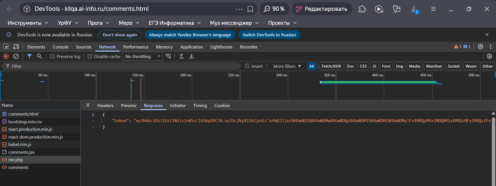

### Задание 4. Bearer в запросах
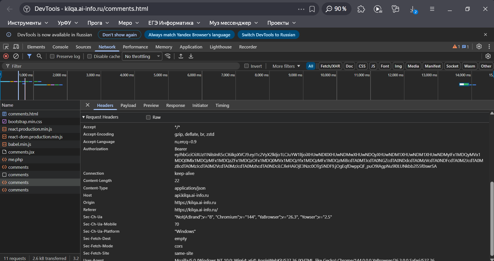
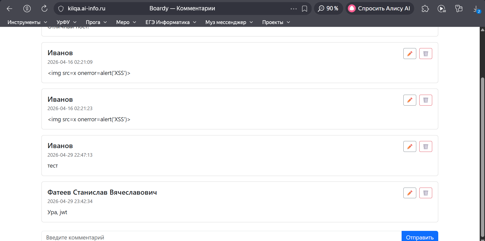

### Задание 5. jwt.io
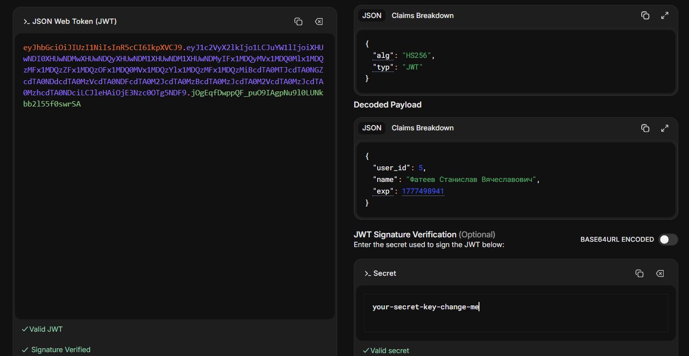

**Ответ:**  
Payload в JWT закодирован в Base64, а НЕ зашифрован. Base64 — это кодировка, которая легко декодируется обратно. Злоумышленник, перехвативший токен, увидит всё содержимое: `user_id`, `exp` и т.д. Это не проблема, потому что JWT подписан. Злоумышленник может прочитать данные, но не может их изменить (подпись станет невалидной). Секретные данные (пароль, email) в JWT класть нельзя.

### Задание 6. Истёкший токен
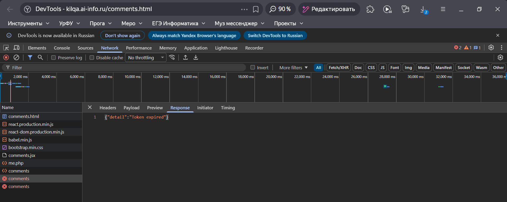

### Задание 7. Невалидный токен
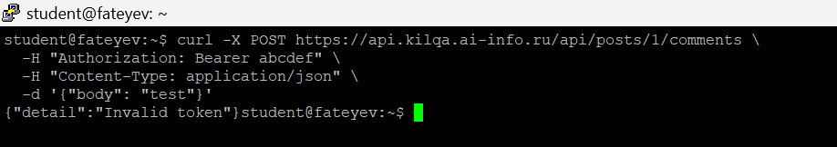

## Часть B. OAuth через GitHub

### Задание 8. OAuth App на GitHub
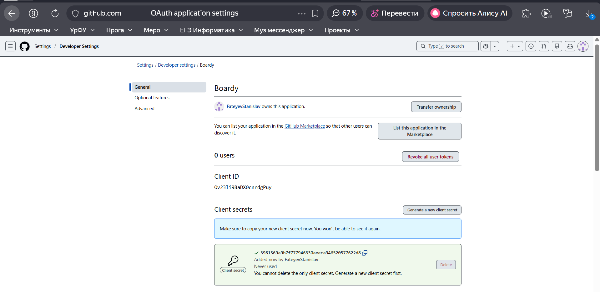

### Задание 9. Столбец github_id
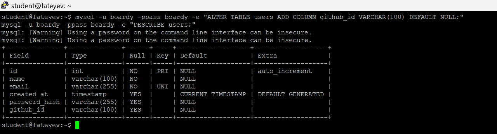

### Задание 10. Кнопка «Войти через GitHub»
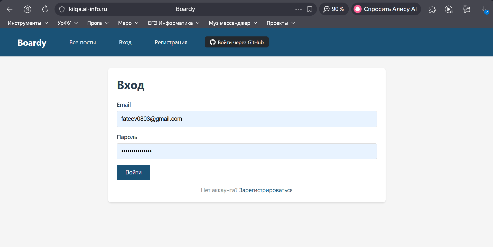

### Задание 11. OAuth flow
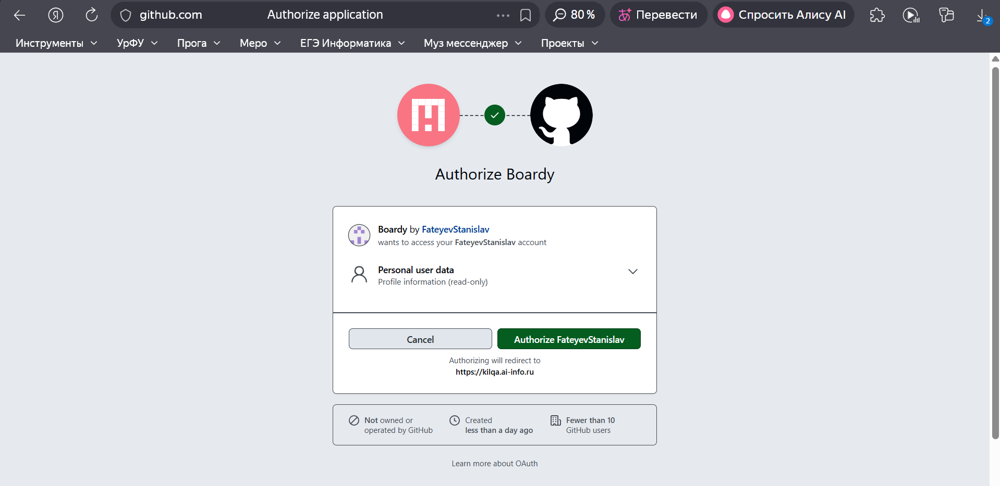
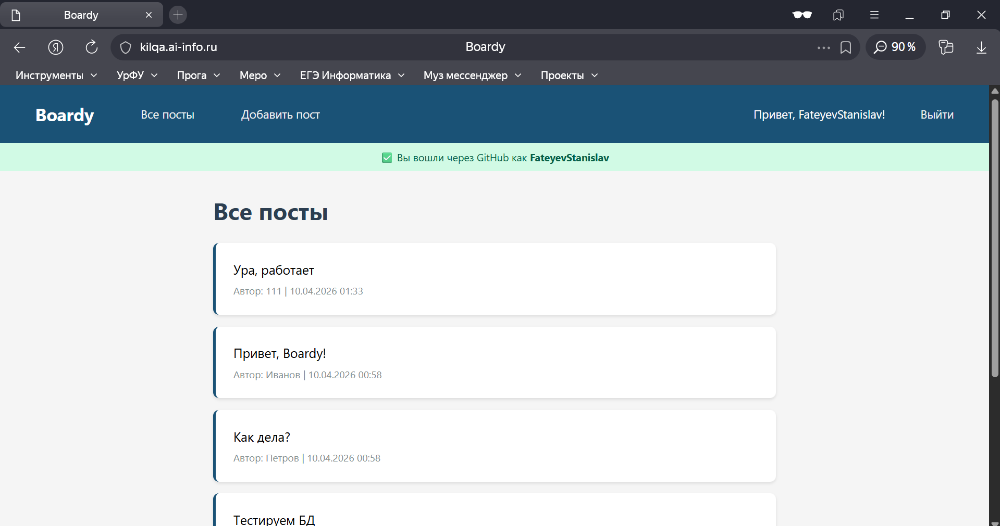

### Задание 12. github_id в базе
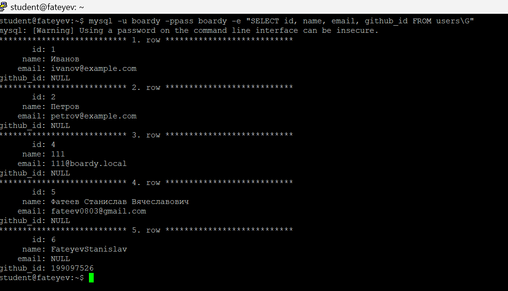

**Ответ:**  
Ищем по `github_id`, а не по email, потому что у пользователя GitHub может быть несколько email-адресов, и публичный email может отсутствовать. GitHub ID — это уникальный числовой идентификатор, который гарантированно не меняется и есть у каждого пользователя. Email может быть не верифицирован или пользователь мог его скрыть в настройках приватности.

### Задание 13. OAuth → JWT → API
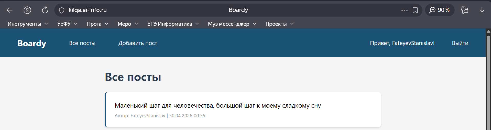

**Ответ:**  
Полный flow:

1. Пользователь нажимает «Войти через GitHub» на `login.php`
2. Браузер перенаправляется на `https://github.com/login/oauth/authorize` с `client_id`
3. GitHub показывает экран Authorize
4. Пользователь нажимает Allow
5. GitHub перенаправляет на `oauth-callback.php` с кодом `?code=...`
6. `oauth-callback.php` обменивает код на access_token
7. `oauth-callback.php` запрашивает данные пользователя (id, login, email)
8. `oauth-callback.php` создаёт/обновляет запись в `users` (записывает `github_id`)
9. `oauth-callback.php` создаёт сессию: `$_SESSION['user_id'] = $user_id`
10. Редирект на `messages.php` (пользователь залогинен через сессию)
11. React на странице с комментариями делает запрос к `/api/me.php`, кука отправляется автоматически
12. `me.php` из сессии достаёт `user_id`, генерирует JWT, возвращает его
13. React сохраняет JWT, отправляет с каждым запросом к FastAPI в `Authorization: Bearer`
14. FastAPI через `auth.py` проверяет JWT, достаёт `user_id`, создаёт комментарий от этого автора

### Задание 14. Параметр state

**Ответ:**  
`state` — это случайная строка, которую приложение генерирует перед редиректом на GitHub и проверяет в callback'е. Она защищает от CSRF-атак.

Сценарий CSRF-атаки без state:
1. Злоумышленник регистрирует своё приложение на GitHub
2. Злоумышленник создаёт ссылку: `https://github.com/login/oauth/authorize?client_id=ЗЛОДЕЙСКИЙ_ID&redirect_uri=https://сайт-жертвы/oauth-callback.php`
3. Злоумышленник подсовывает эту ссылку жертве (например, в комментарии)
4. Жертва кликает → GitHub спрашивает «Дать доступ ЗЛОДЕЮ?»
5. Если жертва нажимает Allow, GitHub редиректит с кодом на сайт жертвы
6. `oauth-callback.php` жертвы обменивает код на токен и привязывает **чужой** GitHub к аккаунту жертвы (или создаёт аккаунт с чужими данными)

С `state`:
1. При генерации ссылки создаётся случайный `state`, который сохраняется в сессии
2. В callback'е проверяется, что `state` из запроса совпадает с сохранённым
3. Злоумышленник не знает `state` из сессии жертвы → атака не работает

## Часть C. Анализ

### Задание 15. Три способа входа
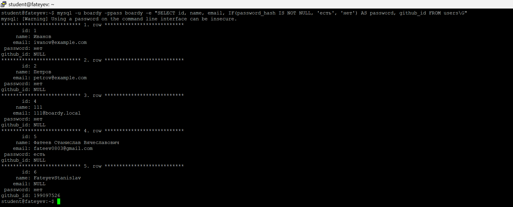

### Задание 16. Сравнение механизмов

**Ответ:**  

| Вопрос | Куки+сессии | JWT | OAuth |
|--------|-------------|-----|-------|
| Где хранятся данные? | На сервере (файл/БД) | В самом токене (на клиенте) | У провайдера (GitHub) |
| Кто прикрепляет к запросу? | Браузер автоматически | Клиент (JS-код вручную) | Провайдер + браузер |
| Для какого типа клиентов? | Веб-браузеры (один домен) | Любые (SPA, мобильные, серверные) | Сторонние сервисы |
| Можно ли отозвать? | Да (удалить файл сессии) | Нет (только по истечении времени) | Да (через GitHub) |
| Кросс-доменно работает? | Нет (SameSite ограничения) | Да (нужно добавить вручную) | Да (редирект) |

### Задание 17. Баги и пакеты

**Ответ:**  
Три бага в моём коде, которые Laravel закрывает из коробки:

1. **SQL-инъекции в ручных запросах**  
   - Что делает мой код: Использую PDO с `prepare()` и `execute()`, но потенциально могу забыть в новом запросе.  
   - Чем опасно: Злоумышленник может выполнить произвольный SQL через параметры.  
   - Какой пакет решает: Eloquent ORM — всё экранируется автоматически, параметры через привязку.  

2. **XSS через вывод данных**  
   - Что делает мой код: Использую `htmlspecialchars()` вручную — легко забыть на новой странице.  
   - Чем опасно: Злоумышленник может внедрить JavaScript через любой выводимый параметр.  
   - Какой пакет решает: Blade-шаблоны `{{ }}` экранируют автоматически, `{!! !!}` только если явно разрешить.  

3. **CSRF на формах**  
   - Что делает мой код: Вообще нет защиты от CSRF.  
   - Чем опасно: Злоумышленник может заставить жертву отправить форму с другого сайта.  
   - Какой пакет решает: Laravel CSRF Protection — автоматически генерирует и проверяет `_token` для всех не-GET запросов.
