# Лабораторная работа 13: WebSocket — реалтайм-лента

## Часть A. FastAPI: WebSocket

### Задание 1. ConnectionManager
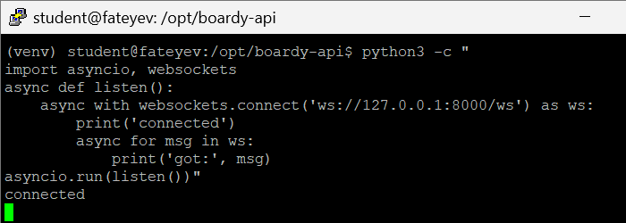

**Ответ:**  
`self.active` — это список активных WebSocket-подключений в памяти текущего процесса FastAPI/Uvicorn. Он хранит живые объекты соединений, а не «данные», поэтому его нельзя сохранять в обычную базу: БД умеет хранить строки и записи, но не открытые TCP-сокеты и ссылки на них.  

Если Uvicorn перезапустится, процесс завершится, память очистится, и список `self.active` полностью пропадёт. Все клиенты будут отключены, им придётся переподключаться заново, потому что in-memory состояние не переживает рестарт и существует только в рамках одного процесса.

---

### Задание 2. /internal/broadcast
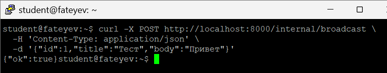

**Ответ:**  
`/internal/broadcast` не требует JWT-авторизации, потому что это не публичный пользовательский endpoint, а внутренний служебный интерфейс между Laravel и FastAPI. Его вызывает сам backend Laravel, поэтому защита строится не через пользовательский токен, а через сетевые ограничения и правила на уровне Nginx.  

Риск в том, что без ограничений любой внешний клиент смог бы слать на `/internal/broadcast` фальшивые события и засорять realtime-ленту. Этот риск закрывает Nginx: для `/internal` настраиваются `allow 127.0.0.1; deny all;`, и endpoint становится доступен только локально (с того же сервера), а все внешние запросы получают 403 Forbidden.

---

### Задание 3. Два клиента
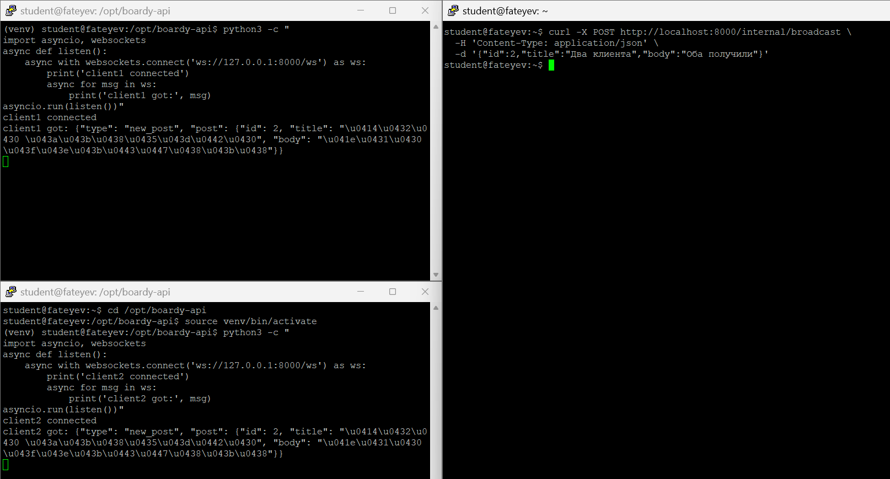

**Ответ:**  
Если один из клиентов успел отключиться, пока выполняется broadcast, попытка отправить ему сообщение приведёт к ошибке записи в закрытое соединение. При правильно написанном менеджере такое соединение удаляется из `self.active`, чтобы в будущем не пытаться слать данные в мёртвый сокет.  

Это обрабатывается в двух местах: в обработчике `WebSocketDisconnect`, который ловит штатное закрытие и сразу убирает клиента из списка, и в самом методе broadcast, где отправка обёрнута в `try/except`. Если при отправке ловится ошибка, текущий клиент тоже выкидывается из списка активных подключений.

---

## Часть B. Laravel: HTTP-callback

### Задание 4. PostController
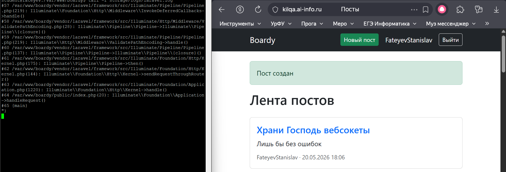

**Ответ:**  
`timeout(2)` нужен, чтобы HTTP-вызов FastAPI не зависал слишком долго и не блокировал ответ пользователю при создании поста. Laravel подождёт максимум пару секунд, и если FastAPI недоступен, запрос завершится по таймауту, ошибка попадёт в лог, а пользовательский поток не будет висеть бесконечно.  

Если timeout не указать, Laravel будет ждать по умолчанию (часто заметно дольше), и при проблемах с FastAPI форма создания поста будет отвечать очень медленно или «залипать». При этом сам пост уже может быть успешно сохранён в БД, но из-за подвисающего callback UX для пользователя сильно ухудшится.

---

### Задание 5. Проверка callback
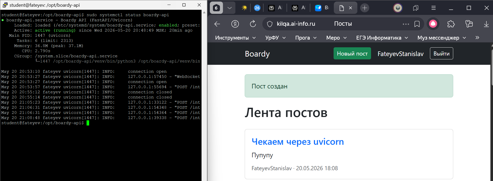

**Ответ:**  
Такая архитектура считается костылём, потому что вместо нормальной событийной шины (очереди, брокера сообщений) используется дополнительный синхронный HTTP-звонок из Laravel в FastAPI. Один backend вручную дёргает другой, между ними появляется хрупкая связка по URL, структуре JSON, таймаутам и доступности второго сервиса.  

Минимум три проблемы:  
1. **Сильная связность сервисов.** Laravel должен знать точный адрес `/internal/broadcast` и формат тела — любое изменение на стороне FastAPI требует правок в Laravel.  
2. **Синхронная зависимость.** Если FastAPI тормозит или падает, страдает время ответа Laravel, хотя бизнес-операция (создание поста) уже могла пройти успешно.  
3. **Отсутствие гарантированной доставки.** HTTP-callback не даёт очереди, повторных попыток и буфера: если FastAPI недоступен в момент запроса, событие просто теряется. При росте нагрузки такое решение хуже масштабируется, чем брокер типа Redis/RabbitMQ.

---

## Часть C. JS клиент

### Задание 6. WebSocket в Blade
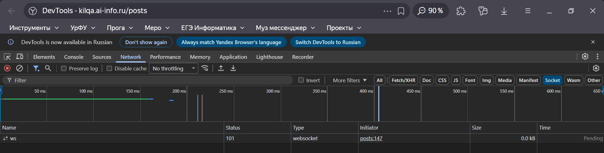

**Ответ:**  
На локальной машине обычно используется `ws://`, потому что трафик идёт по обычному HTTP без TLS, и WebSocket тоже поднимается без шифрования. Для продакшена нужен `wss://` — это WebSocket поверх TLS, аналог HTTPS: соединение шифруется и нормально работает за обратным прокси с сертификатами.  

Если попытаться использовать `wss://` без настроенного TLS (без HTTPS и сертификата), рукопожатие не пройдёт: браузер ожидает защищённый канал и валидный TLS, но не получает его. В итоге WebSocket-соединение просто не откроется, в DevTools будет ошибка подключения.

---

### Задание 7. Два браузера
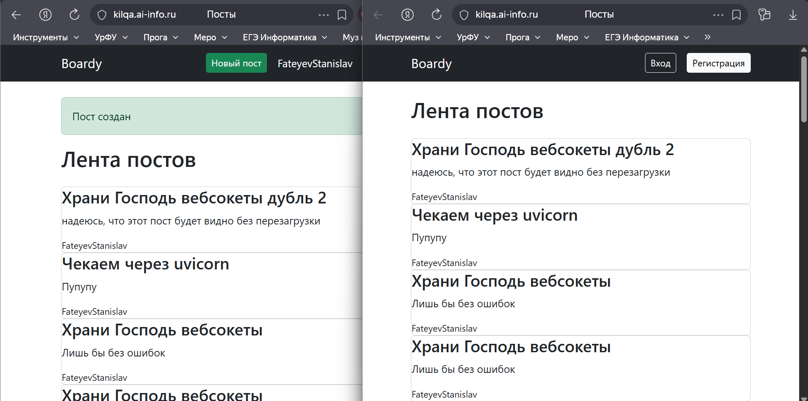

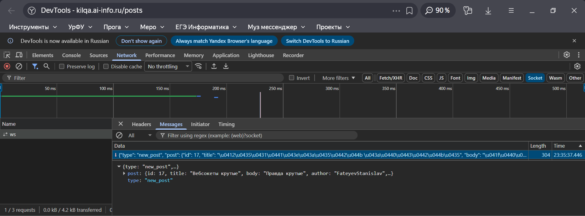

---

### Задание 8. XSS
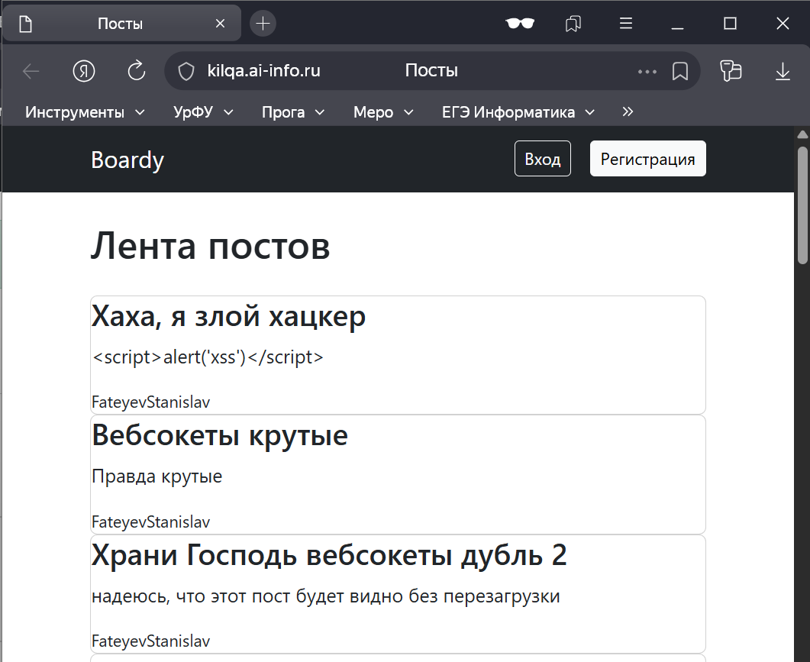

**Ответ:**  
Функция `escapeHtml()` заменяет опасные символы (`<`, `>`, `&`, `"`, `'`) на безопасные HTML-сущности (`&lt;`, `&gt;`, `&amp;` и т.п.), чтобы строка воспринималась браузером как текст, а не как разметка или JavaScript. Благодаря этому `` выводится в ленте как обычный текст и не выполняется.  

Если вставлять данные напрямую в `innerHTML` без экранирования, браузер воспримет их как HTML-код. Тогда злоумышленник может внедрить `<script>` или другие опасные теги, и код выполнится у других пользователей — это классическая XSS: кража сессий, подмена интерфейса, выполнение произвольного JS.

---

### Задание 9. Переподключение
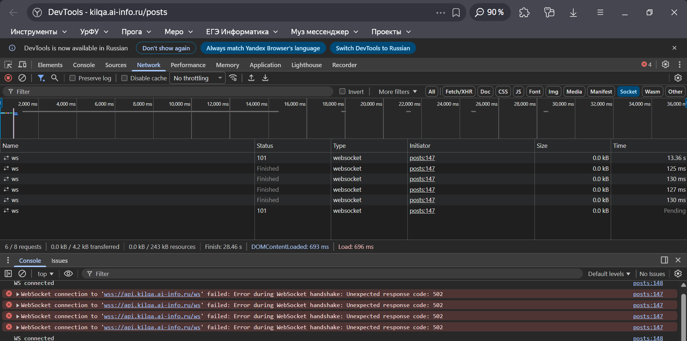

---

## Часть D. Nginx

### Задание 10. WS-проксирование
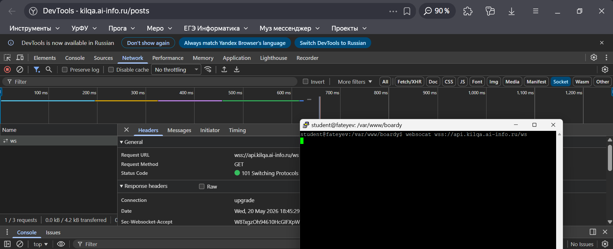

**Ответ:**  
Если убрать `proxy_http_version 1.1`, Nginx может общаться с upstream по HTTP/1.0, а протокол WebSocket опирается на механизм Upgrade, корректно работающий только с HTTP/1.1. В результате Upgrade-запрос может не пройти, и соединение не переключится в WebSocket-режим.  

Если убрать `proxy_set_header Upgrade`, приложение за Nginx не увидит заголовок Upgrade и не поймёт, что клиент хочет сменить протокол на WebSocket. Тогда оно обработает запрос как обычный HTTP и не вернёт статус 101 Switching Protocols.  

Если убрать `proxy_read_timeout`, Nginx будет считать, что соединение «зависло», если долго нет данных от upstream, и преждевременно оборвёт WebSocket. Для долгоживущих соединений это критично: даже при нормальной работе, когда некоторое время нет сообщений, прокси не должен рвать подключение.

---

### Задание 11. Закрыть /internal
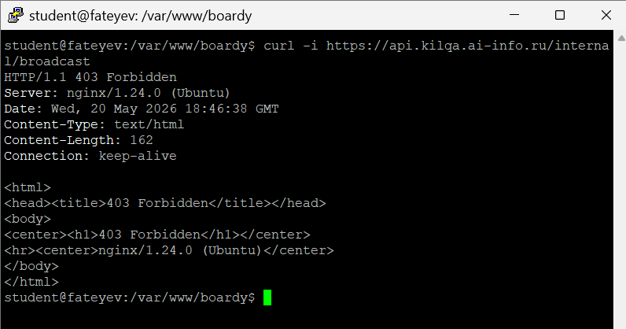

**Ответ:**  
`/internal/broadcast` опасен без ограничения доступа, потому что через него можно отправлять события всем подключённым клиентам. Если оставить его открытым наружу, любой желающий мог бы слать туда запросы и генерировать спам в ленте, подделывать системные уведомления или перегружать realtime-сервис.  

Вызвать его мог бы любой внешний HTTP-клиент: `curl` с чужого сервера, скрипт в браузере, бот, сканер уязвимостей или злоумышленник, нашедший URL. Поэтому этот endpoint нужно закрывать на уровне Nginx по IP (например, `allow 127.0.0.1; deny all;`) или вообще выносить в отдельный внутренний контур, доступный только другим сервисам внутри инфраструктуры.
