# Лабораторная работа 14: OAuth2, PKCE, FastAPI и Redis

## Часть A. Passport как OAuth 2.1 сервер

### Задание 1. Установка и SPA-клиент

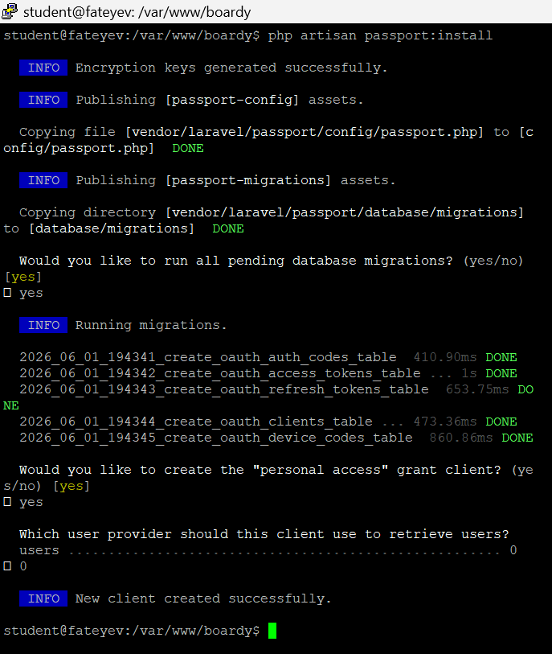  
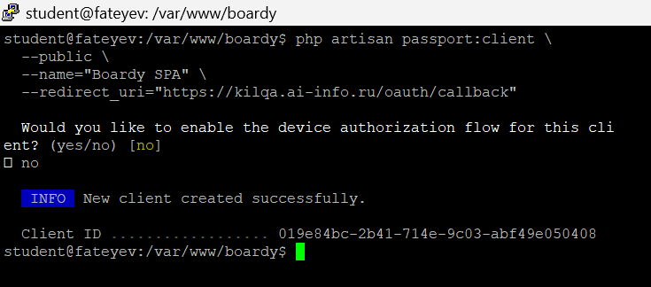

**Ответ:**  
Публичный клиент не хранит `client_secret`, потому что он работает на стороне пользователя (SPA в браузере или мобильное приложение) и его код полностью доступен атакующему. Любой «секрет» в таком клиенте не может оставаться секретом: его можно извлечь из JS-кода, из devtools или из бинарника и использовать для выдачи токенов от имени легального клиента. Поэтому публичным клиентам `client_secret` не выдают — они аутентифицируются иначе.

PKCE заменяет `client_secret` парой `code_verifier`/`code_challenge`. На этапе `/authorize` клиент отправляет только `code_challenge` (хэш от случайного `code_verifier`), а «сырой» `code_verifier` держит у себя. На этапе `/token` он доказывает, что именно он инициировал авторизацию, предъявляя исходный `code_verifier`, который сервер проверяет, пересчитывая `code_challenge`. Такой механизм защищает от атаки «подмена авторизационного кода» (authorization code interception): если злоумышленник украдёт `code` из URL, он не сможет обменять его на токен без верного `code_verifier`.

---

### Задание 2. TTL и refresh

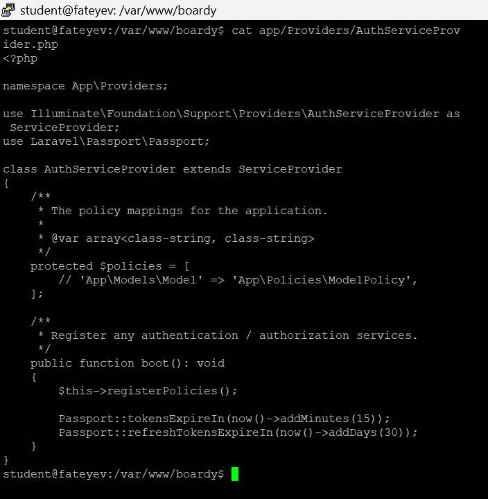

**Ответ:**  
Access-токен делают короткоживущим (например 15 минут), потому что именно он даёт прямой доступ к API без дополнительных проверок. Если такой токен украдут (через XSS, утечку логов, сниффинг в небезопасной сети), злоумышленник сможет действовать только ограниченное время. Refresh-токен выдаётся на более долгий срок (30 дней), чтобы пользователь не логинился заново каждые 15 минут: фронтенд просто бесшовно обновляет access-токен по refresh-токену.

Если поставить access-токену срок жизни 24 часа, украденный токен даст атакующему полный доступ почти на сутки. Это сильно увеличивает окно уязвимости: даже если утечку заметят быстро, пользователь всё равно рискует, пока токен не истечёт или не будет отозван. Короткий TTL сокращает риск и заставляет чаще опираться на более защищённый refresh-токен.

---

### Задание 3. Проверка выдачи через curl

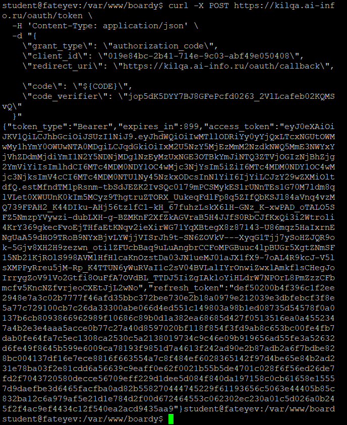

**Ответ:**  
В этом `curl`-сценарии последовательно проходят основные шаги Authorization Code PKCE flow:

1. Клиент генерирует случайный `code_verifier` и на его основе `code_challenge` (обычно методом S256).
2. Клиент перенаправляет пользователя на `/oauth/authorize`, передавая `response_type=code`, `client_id`, `redirect_uri`, `code_challenge` и `code_challenge_method=S256`. Пользователь логинится и подтверждает доступ, сервер выдаёт `code` на `redirect_uri`.
3. Клиент (через `curl`) отправляет запрос на `/oauth/token` с `grant_type=authorization_code`, `code`, `redirect_uri`, `client_id` и `code_verifier`. Сервер пересчитывает `code_challenge` из `code_verifier` и сверяет с сохранённым значением.
4. При успешной проверке сервер возвращает `access_token`, `refresh_token` и прочие поля ответа.  

Таким образом, `curl`-запрос реализует обмен авторизационного кода на токены с проверкой PKCE вместо `client_secret`.

---

## Часть Б. Две базы данных

### Задание 4. Создание boardy_api

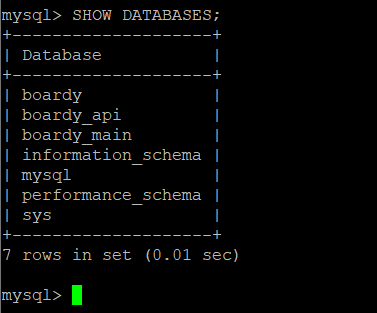  
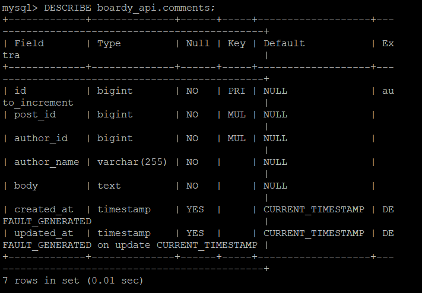

**Ответ:**  
В таблице `comments` нет внешних ключей на `posts` и `users`, потому что структура спроектирована как денормализованная и слабо связанная: `author_id` и `post_id` хранятся как обычные числа, а имя автора продублировано в `author_name`. Это упрощает миграцию между контейнерами/БД и позволяет FastAPI иметь свою схему, не завязанную жёстко на Laravel-базу. Минус такого подхода — потеря автоматического контроля целостности: БД не запретит удалить пост или пользователя, к которым всё ещё привязаны комментарии.

Чтобы сохранять целостность данных в такой схеме, проверку нужно делать на уровне приложений: Laravel и FastAPI должны перед удалением пользователя/поста либо запрещать операцию, если есть связанные комментарии, либо каскадно чистить/обновлять комментарии (логическое удаление, анонимизация, пересвязка). Также можно периодически запускать фоновую проверку (job), которая находит «висячие» комментарии без существующих пользователей/постов и исправляет или удаляет их.

---

### Задание 5. FastAPI подключён к новой БД

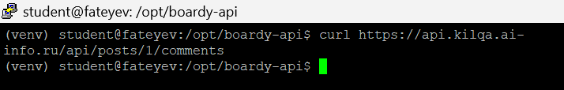

---

## Часть В. FastAPI: RS256 + полный CRUD

### Задание 6. RS256 проверка

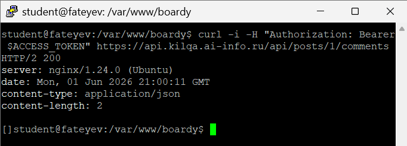  
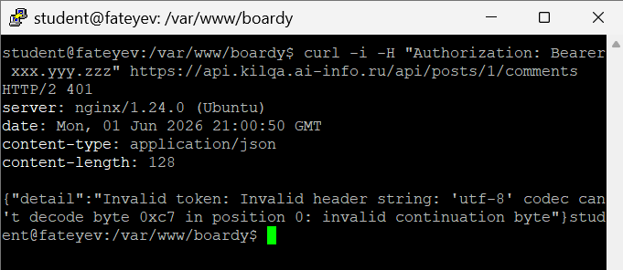

**Ответ:**  
RS256 безопаснее HS256 для распределённых систем, потому что использует асимметричную криптографию: токен подписывается приватным ключом на стороне авторизационного сервера, а сервисы-потребители проверяют подпись только публичным ключом. Приватный ключ не нужно раздавать микросервисам, его можно хранить и защищать централизованно, а публичный ключ можно кэшировать и обновлять.  

В случае HS256 все стороны должны знать один и тот же секрет. Любой сервис, имеющий `SECRET_KEY`, технически способен не только проверять, но и выпускать токены, что расширяет поверхность атаки: компрометация любого микросервиса с этим секретом позволяет атакующему выпускать валидные JWT. С RS256 даже при компрометации потребителя токенов публичный ключ не даёт возможности подделать подпись.

---

### Задание 7. Полный CRUD с author_name

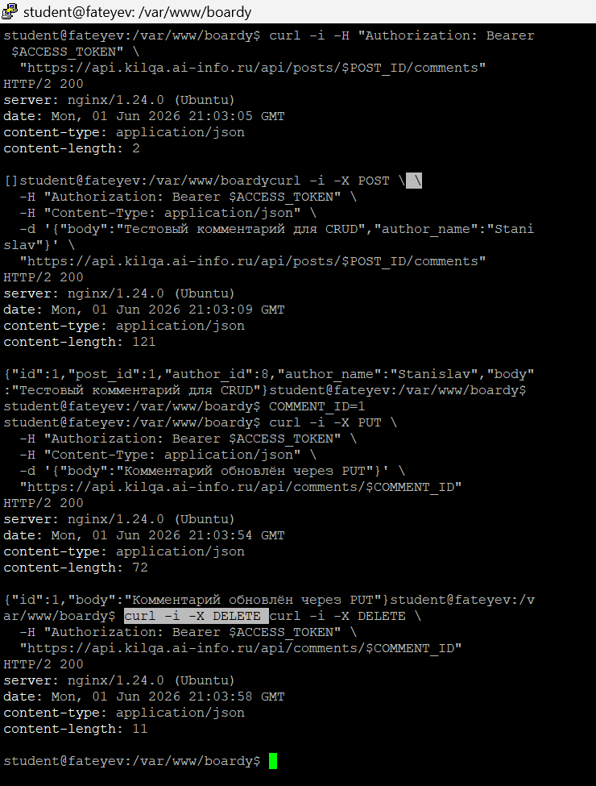

**Ответ:**  
Поле `author_name` передаётся в payload запроса, а не извлекается из токена, потому что FastAPI здесь работает с денормализованной копией данных, а не с единственным источником правды о пользователе. Комментарии в `boardy_api` хранят снэпшот имени на момент создания/изменения, который может отличаться от текущего имени в паспорте/профиле (например, при ретроспективном отображении истории).  

Если зашить имя пользователя в custom claim JWT и использовать его для `author_name`, любой смены имени в профиле не будет видно до выпуска нового токена. Более того, имя в токене будет зависеть от момента логина: один и тот же пользователь в разных сессиях будет «приносить» разные значения имени в зависимости от давности токена. В итоге денормализованные данные становились бы несогласованными, а корректное обновление имени требовало бы сложной логики по отзыву и перевыпуску токенов.

---

### Задание 8. Owner check

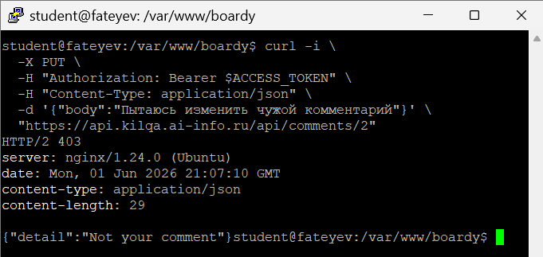

**Ответ:**  
Проверка владельца выполняется в обработчиках `PUT` и `DELETE` в FastAPI: перед изменением или удалением комментария код сравнивает `author_id` комментария с идентификатором пользователя, извлечённым из JWT (например, `sub` или `user_id` в токене). Если они не совпадают, обработчик возвращает ошибку `403 Forbidden` и не даёт изменить чужие данные.  

Если убрать эту проверку, любой пользователь с валидным токеном смог бы модифицировать или удалять комментарии любого другого пользователя, если знает ID комментария. Это превращает систему в небезопасную: возникает возможность целенаправленного стирания чужого контента, подмены текста, а также массовых атак на данные (скрипт перебирает ID и удаляет всё подряд).

---

### Задание 9. CORS

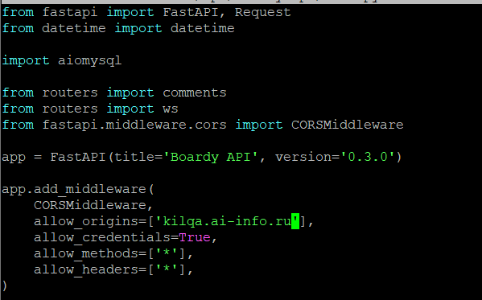

**Ответ:**  
Комбинация `allow_origins=['*']` и `credentials=true` нарушает спецификацию CORS: браузер просто блокирует такой ответ, потому что нельзя одновременно разрешить куки/авторизационные заголовки и заявлять, что ресурс разрешён для «всех» доменов. Для запросов с учётом учётных данных (credentials) CORS требует указать точный `Origin`, которому доверяет сервер.  

Если бы браузер всё-таки пропускал `allow_origins='*'` с `credentials=true`, это означало бы, что любой сайт мог бы послать запрос с куками пользователя к API и прочитать защищённый ответ. Тогда XSS на любом внешнем домене смогла бы использовать авторизационные куки к твоему API и действовать от имени пользователя — то есть защищённые куки превращались бы в почти публичный токен доступа.

---

## Часть Г. React PKCE flow

### Задание 10. PKCE утилиты

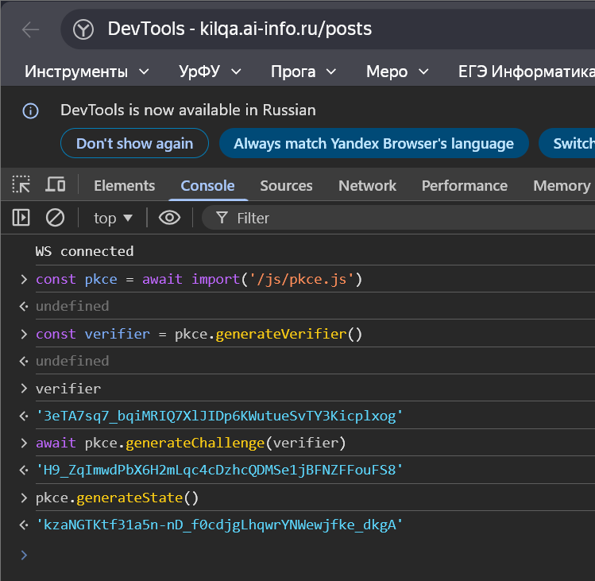

**Ответ:**  
`code_challenge` передаётся на этап `/authorize`, потому что серверу нужно заранее «запомнить» связку сессии авторизации и ожидаемого challenge: он сохраняет `code_challenge` вместе с `code` и привязывает к клиенту. `code_verifier` держится только у клиента и не передаётся в браузерный редирект. На этапе `/token` клиент предъявляет `code_verifier`, а сервер пересчитывает из него `code_challenge` и сравнивает с сохранённым значением.

Если перепутать и отправлять `code_verifier` на `/authorize`, а `code_challenge` на `/token`, защита PKCE ломается: сервер либо не сможет корректно проверить токен (будет ошибка), либо, если логика реализована неправильно, откроется возможность подмены кода. В нормальной реализации сервер ожидает именно `code_challenge` при авторизации и именно `code_verifier` при обмене кода на токен; любая перестановка нарушит проверку.

---

### Задание 11. Login flow

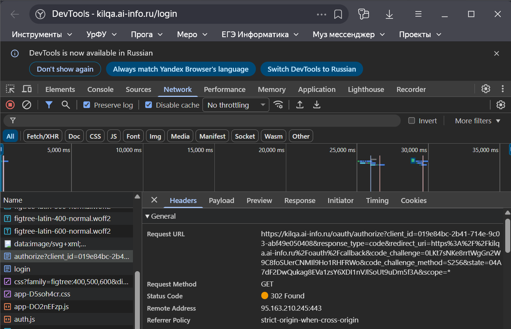  
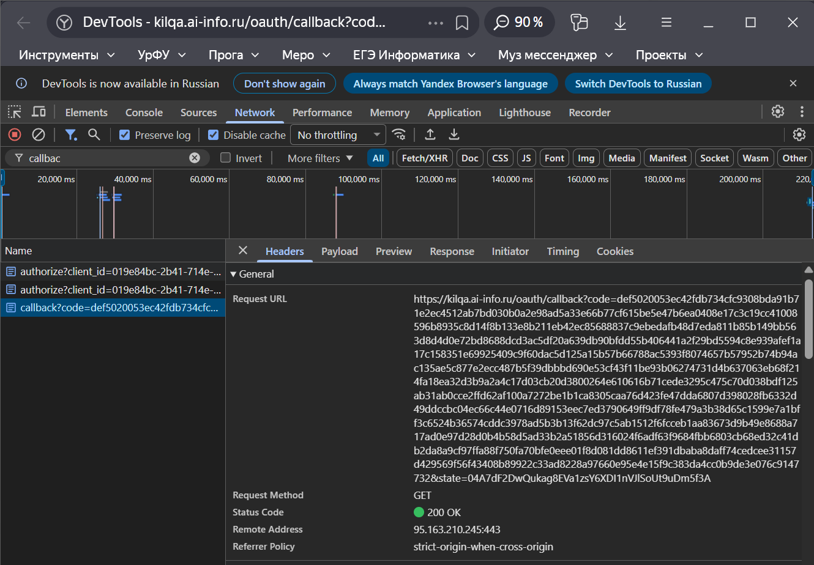

---

### Задание 12. Обмен code на токены

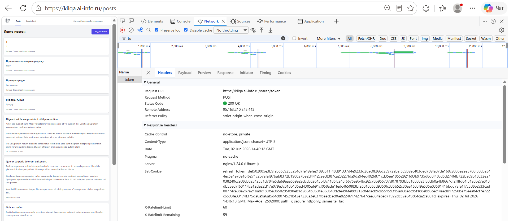

**Ответ:**  
Если убрать проверку `state` в `handleCallback`, приложение становится уязвимым для CSRF/вставки чужого кода (authorization code substitution). Злоумышленник может заставить браузер пользователя выполнить редирект с «чужим» кодом, полученным на контролируемый клиент, и без проверки `state` фронтенд примет этот код как свой.  

В итоге приложение может установить токены, связанные с аккаунтом злоумышленника, в браузер жертвы. Тогда жертва будет думать, что работает со своим профилем, а на самом деле все действия выполнятся в аккаунте атакующего, и он получит, например, сохранённые токены refresh или чувствительные данные.

---

### Задание 13. Refresh token в HttpOnly cookie

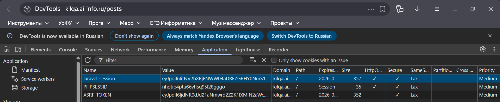

**Ответ:**  
Если положить refresh-токен в `localStorage` и на сайте возникнет XSS, вредоносный скрипт сможет прочитать токен напрямую через JavaScript (`localStorage.getItem('refresh_token')`) и отправить его злоумышленнику. С этим refresh-токеном атакующий сможет бесконечно получать новые access-токены, даже если жертва закроет вкладку или перезагрузит страницу, а иногда — даже после смены пароля, если система не отзывает refresh-токены.

Хранение refresh-токена в HttpOnly-куке делает его недоступным для JS-кода: XSS может отправлять запросы, но не может украсть сам токен и использовать его за пределами браузера жертвы. Это снижает последствия XSS-уязвимостей до уровня «действий в текущей сессии», а не полноценного захвата долгоживущего токена.

---

### Задание 14. Silent refresh

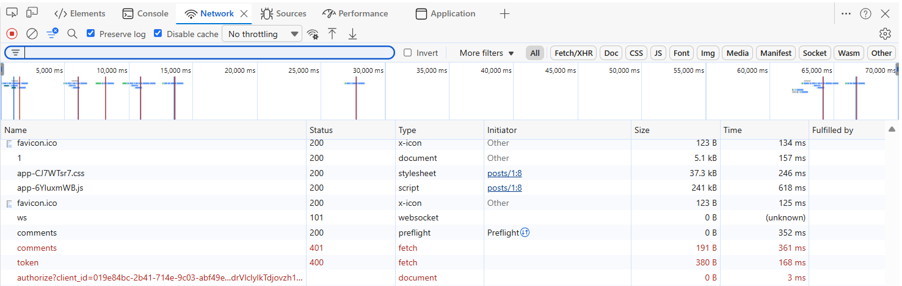

---

## Часть Д. Redis Pub/Sub

### Задание 15. Redis установлен

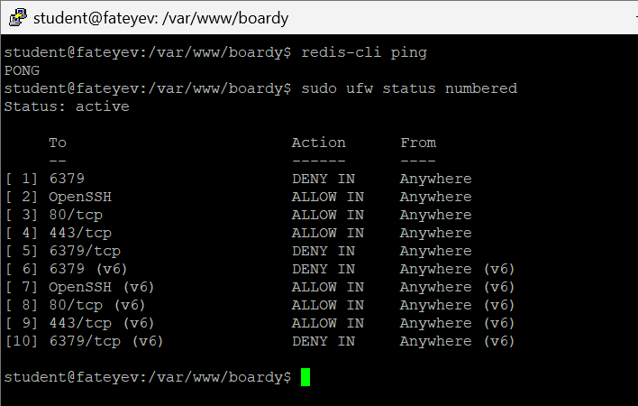

---

### Задание 16. Laravel publish new_post

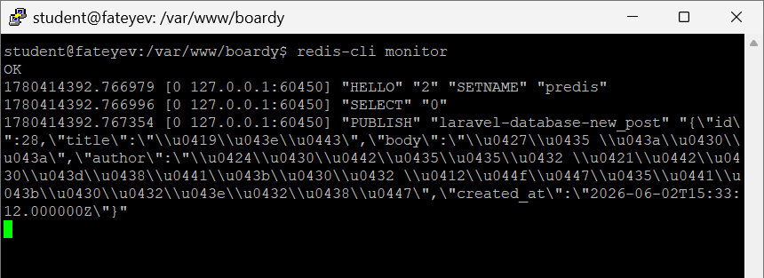

**Ответ:**  
Архитектурно `Redis::publish` лучше, чем прямой `Http::post()` к FastAPI, потому что устраняет жёсткую точку связности между сервисами. При HTTP-вызове Laravel должен знать URL FastAPI, ждать ответ, обрабатывать ошибки сети и может блокироваться, если FastAPI недоступен. Это создаёт сильную зависимость и связывает время ответа одного сервиса с доступностью другого.

Pub/Sub через Redis превращает взаимодействие в асинхронное: Laravel просто публикует событие в шину и не ждёт, что конкретный получатель ответит. FastAPI или другие подписчики могут подключаться, перезапускаться, масштабироваться независимо. Это повышает отказоустойчивость, упрощает горизонтальное масштабирование и позволяет добавлять новые потребители событий (другие сервисы, воркеры) без изменения кода Laravel.

---

### Задание 17. FastAPI subscriber на new_post

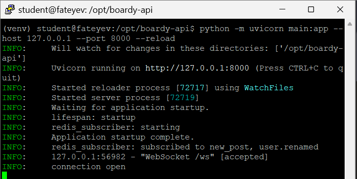  
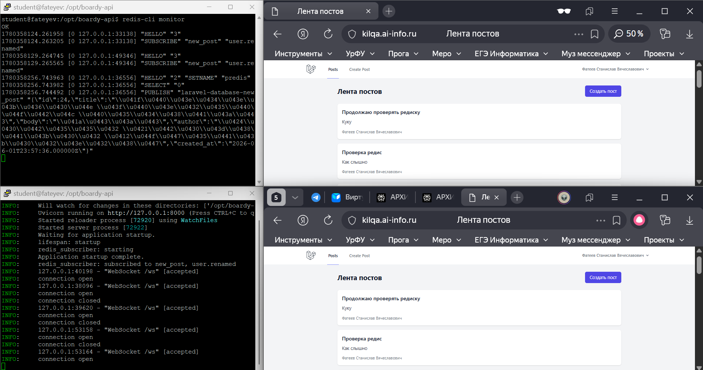

---

### Задание 18. User observer и user.renamed

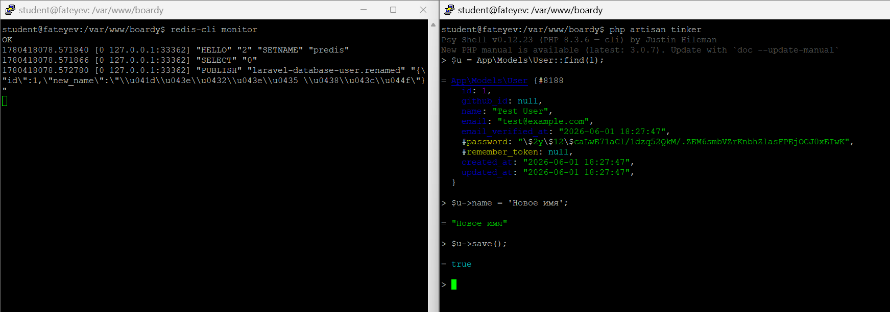

**Ответ:**  
`UserObserver` вызывается автоматически, потому что Laravel регистрирует его в `EventServiceProvider` или в `boot()` метода одной из сервис-провайдеров через вызов вида `User::observe(UserObserver::class)`. После регистрации Eloquent знает, что при событиях модели (`creating`, `updating`, `updated`, и т.п.) нужно вызывать соответствующие методы observer-класса.  

«Магия» Laravel в том, что Eloquent встроенно генерирует события модели и сам вызывает наблюдателей при изменении записей, без необходимости вручную вызывать observer в каждом месте. Разработчик один раз регистрирует observer, а дальше фреймворк автоматически подключает его к жизненному циклу модели.

---

### Задание 19. Денормализация имени

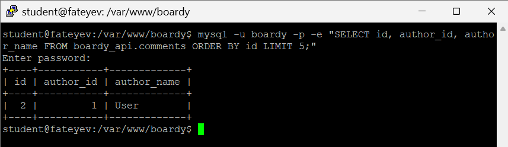  
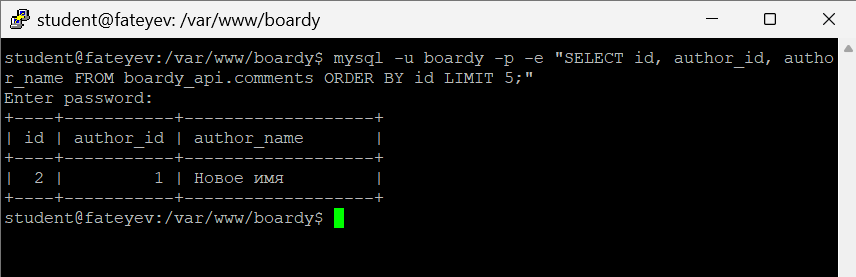

**Ответ:**  
Eventual consistency — это модель согласованности, при которой разные хранилища не обязаны быть синхронно одинаковыми в каждый момент времени, но «со временем» приходят к одному состоянию. В нашем случае имя пользователя хранится и в основной базе Laravel (в таблице пользователей), и в денормализованном виде в комментариях FastAPI. При изменении имени событие `user.renamed` публикуется в Redis, и FastAPI обновляет `author_name` не мгновенно, а по мере обработки сообщения.

Между моментом смены имени в профиле и обновлением всех записей `comments` может быть задержка: Redis может быть временно недоступен, subscriber FastAPI может быть перезапущен, очередь сообщений может обработаться не сразу или обновление может занять время из-за объёма данных. В этот интервал пользователь уже увидит новое имя в своём профиле, но старое имя в некоторых комментариях, пока система не «догонит» и не приведёт все копии данных к одному состоянию.

---

## Часть Е. Финальные проверки

### Задание 20. Два браузера: посты в реалтайме

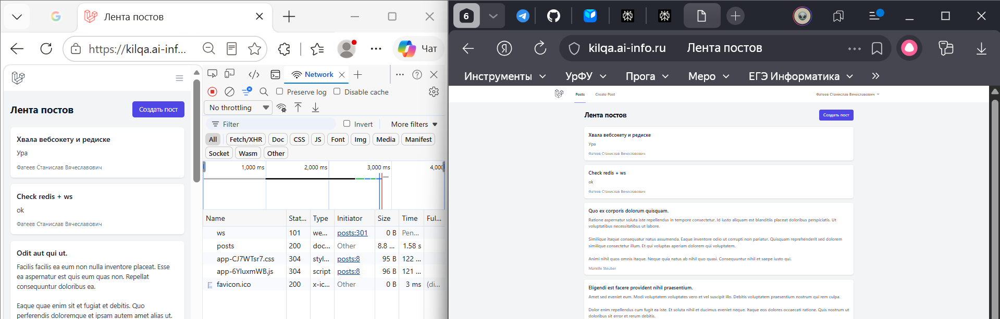

---

### Задание 21. Два браузера: комментарии в реалтайме

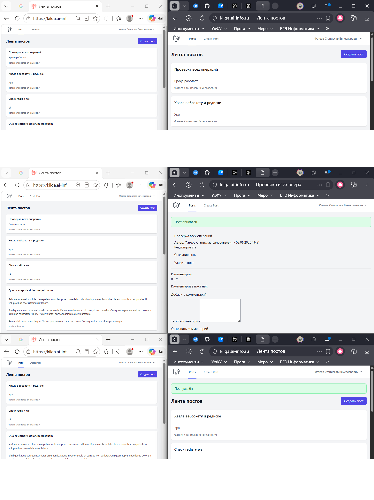

---

### Задание 22. Никаких прямых HTTP-вызовов

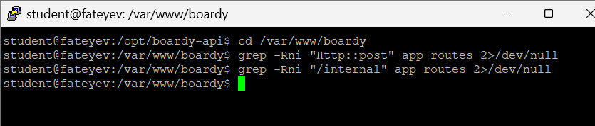  
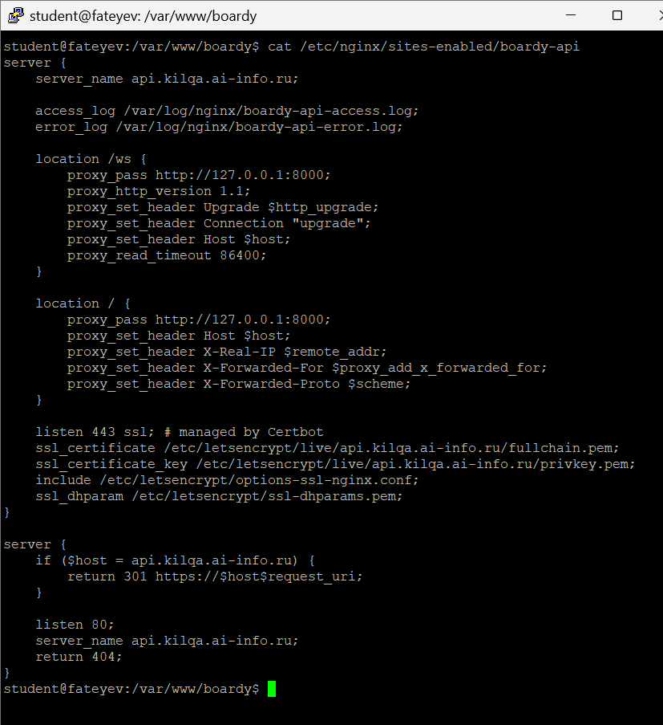