# Лабораторная работа 15: Docker и Docker Compose

## Часть A. Dockerfile для Laravel

### Задание 1. PHP-FPM с расширениями

**Ответ:**  
PHP-FPM в Docker даёт более гибкую и модульную архитектуру по сравнению с образом «Apache+PHP». PHP-FPM работает как отдельный процесс-менеджер, а Nginx выступает в роли обратного прокси и просто прокидывает запросы на PHP, что позволяет независимо масштабировать и настраивать веб-сервер и PHP-интерпретатор. Такой подход хорошо вписывается в микросервисную архитектуру: один контейнер отвечает за статику и маршрутизацию, другой — за выполнение PHP-кода, их можно обновлять и перезапускать отдельно.

---

### Задание 2. Кеширование composer-зависимостей

**Ответ:**  
Если сначала скопировать только `composer.json` и `composer.lock`, а затем выполнить `composer install`, Docker создаст отдельный слой с установленными зависимостями, который будет переиспользоваться до тех пор, пока не изменятся файлы `composer.*`. При последующих сборках, если код приложения изменился, но список зависимостей нет, слой с `composer install` помечается как `CACHED`, и установка пакетов не выполняется заново — это значительно ускоряет сборку.  
Если же сделать `COPY . .` до `composer install`, то любое изменение в любом PHP/JS-файле будет инвалидировать слой с зависимостями. Docker посчитает контент контекста другим и пересоберёт слой `composer install` каждый раз, что приведёт к долгой сборке даже при мелких изменениях в коде.

---

### Задание 3. .dockerignore

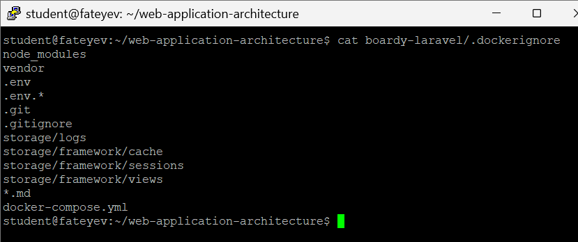

**Ответ:**  
Если не исключить `.env` из образа и закоммитить его внутрь контейнера, то все секреты (пароли к БД, ключи OAuth, токены сторонних сервисов) окажутся «зашиты» в сам образ. Такой образ легко передать, выложить в реестр или случайно сделать публичным, и тогда любой, кто получит доступ к образу, сможет прочитать `.env` и использовать эти креденшалы. Это прямое нарушение принципа «secrets out of the image» и угроза безопасности: утечка `.env` часто равна компрометации всей инфраструктуры (БД, Redis, внешние API).

---

## Часть Б. Dockerfile для FastAPI

### Задание 4. requirements.txt

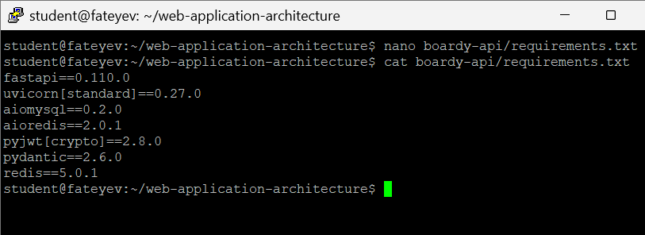

**Ответ:**  
Версии зависимостей фиксируют, чтобы окружение было воспроизводимым: сегодня приложение собирается и работает с одним набором пакетов, и через год сборка даёт тот же набор версий. Если вместо фиксированных версий указывать `latest`, то при каждой установке будут подтягиваться свежие релизы библиотек, которые могут содержать несовместимые изменения или баги. Через год без фиксации можно столкнуться с тем, что код, который раньше работал, внезапно перестаёт запускаться или ведёт себя иначе из-за обновлений зависимостей, и будет очень сложно воспроизвести старое рабочее состояние.

---

### Задание 5. Сборка образа

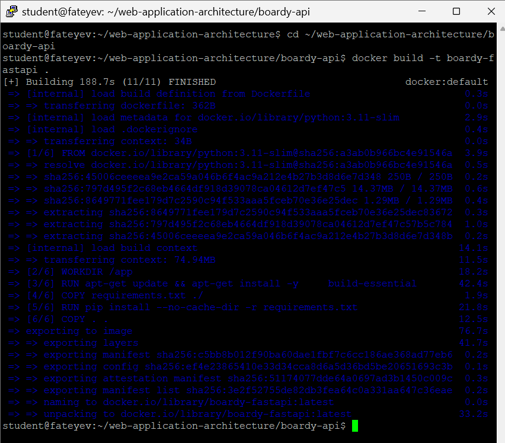

---

### Задание 6. CMD с правильным host

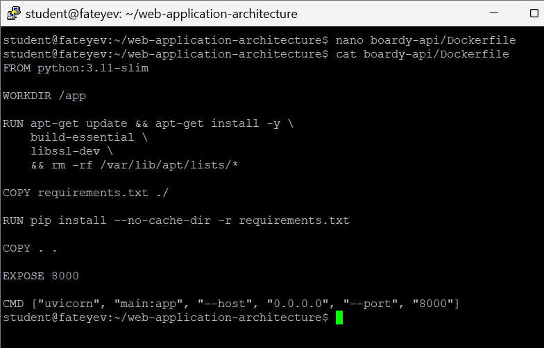

**Ответ:**  
Параметр `--host 0.0.0.0` говорит Uvicorn слушать все сетевые интерфейсы внутри контейнера, чтобы к приложению могли подключаться другие контейнеры и хост-машина. Если оставить `127.0.0.1`, сервер будет доступен только изнутри самого контейнера, а другие сервисы в Docker-сети (Nginx, Laravel и т.п.) не смогут достучаться до FastAPI по его порту. В результате запросы через обратный прокси будут падать с ошибками подключения, хотя приложение формально «запущено».

---

## Часть В. Конфиг Nginx

### Задание 7. docker/nginx/default.conf

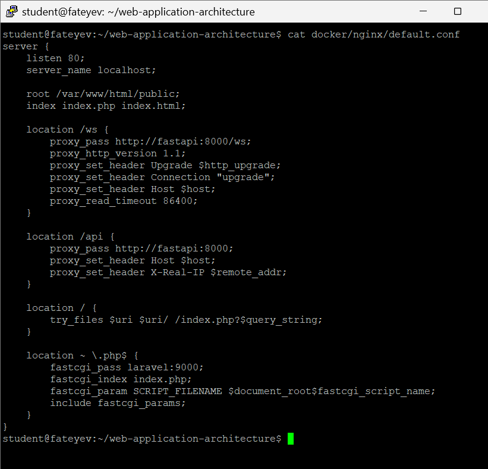

**Ответ:**  
Использование `laravel:9000` вместо `127.0.0.1:9000` основано на том, что Docker для Compose-сервисов поднимает внутренний DNS и регистрирует имена контейнеров как хосты в их общей сети. Внутри сети `boardy_net` имя сервиса `laravel` резолвится в IP-адрес соответствующего контейнера, и Nginx может обращаться к нему как к обычному хосту. Если прописать `127.0.0.1`, Nginx будет пытаться подключиться к самому себе (локальному контейнеру Nginx), а не к контейнеру PHP-FPM, и FastCGI-запросы просто не дойдут до Laravel.

---

### Задание 8. WebSocket location

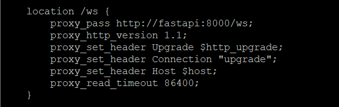

---

## Часть Г. docker-compose.yml

### Задание 9. Пять сервисов

---

### Задание 10. Volumes

**Ответ:**  
Если убрать именованный volume `mysql_data` и выполнить `docker compose down`, то при остановке и удалении контейнера MySQL будут уничтожены и данные, так как они хранились только в файловой системе контейнера. При следующем `docker compose up` база будет пустой, все таблицы и записи пропадут. Именованный volume хранится независимо от жизненного цикла контейнера, поэтому данные переживают пересоздание контейнера. Bind-mount монтирует конкретную директорию с хоста внутрь контейнера, а именованный volume управляется самим Docker и живёт в своём каталоге, не завязанном напрямую на структуру проекта на хосте.

---

### Задание 11. Healthcheck для MySQL и Redis

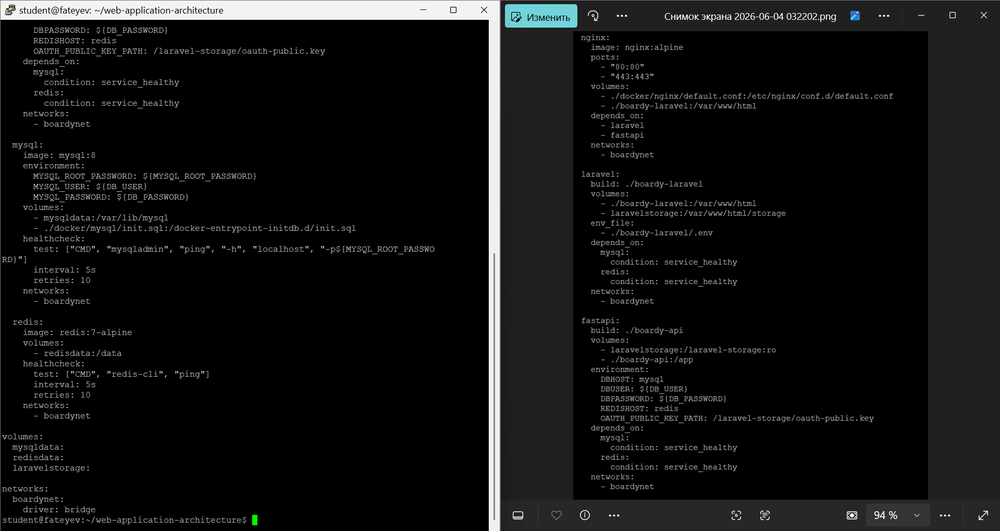

**Ответ:**  
`depends_on` без healthcheck гарантирует только порядок старта контейнеров, но не то, что сервис внутри контейнера действительно готов принимать запросы. MySQL может уже запуститься как процесс, но ещё выполнять инициализацию, миграции или прогрев, а Laravel/FastAPI в этот момент попытаются подключиться и получат ошибку «connection refused» или «too many retries». Возникает гонка (race condition) между моментом старта зависимого сервиса и реальной готовностью базы/кэша. Healthcheck позволяет явно дождаться состояния `healthy`, и только после этого запускать зависящие сервисы, уменьшая вероятность таких ошибок на старте.

---

### Задание 12. init.sql для двух БД

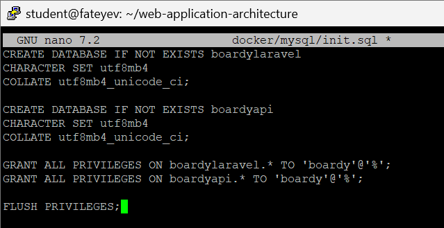  
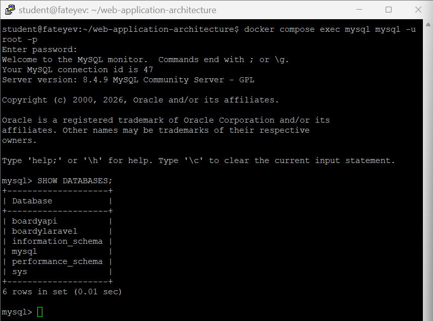

**Ответ:**  
`init.sql` в официальном образе MySQL выполняется только при первом создании данных в volume: скрипты из `/docker-entrypoint-initdb.d` запускаются, когда у MySQL ещё нет системных таблиц и пользовательских баз. После того как данные инициализированы и volume существует, повторные старты контейнера уже не запускают `init.sql`. Если изменить файл `init.sql` после первого запуска, модификации не применятся автоматически: MySQL будет использовать уже существующие данные из volume и проигнорирует новые изменения в инициализационном скрипте, пока не удалить данные (volume) и не пересоздать базу.

---

### Задание 13. Два .env файла

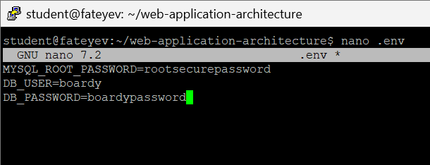  
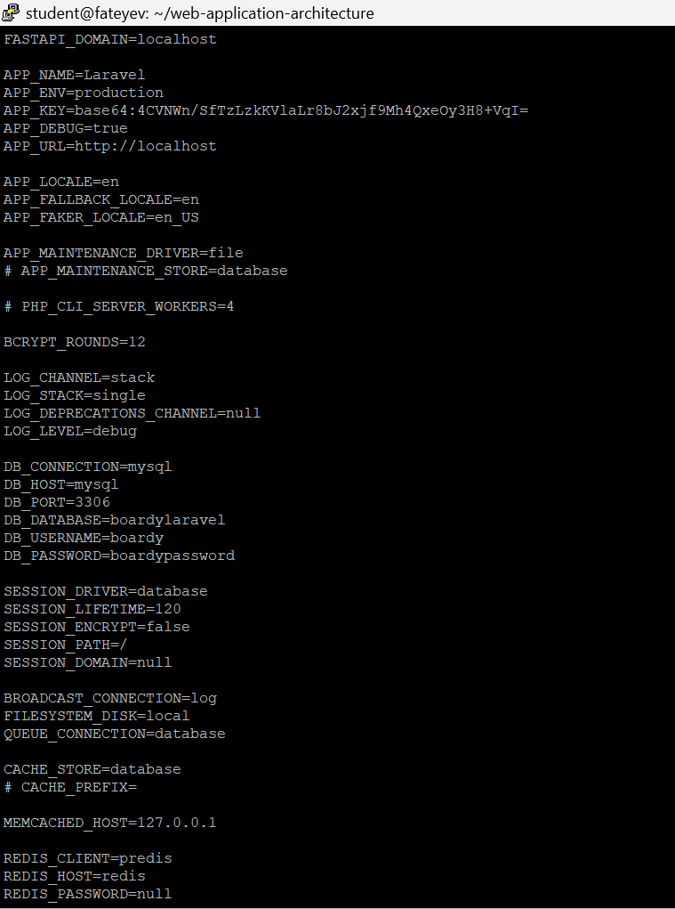

**Ответ:**  
Два разных `.env` нужны для разделения ответственности: корневой `.env` используется Docker Compose для настройки инфраструктуры (пароли БД, имена БД, порты, логины к сервисам), а `boardy-laravel/.env` — для конфигурации самого приложения Laravel (DB_HOST, REDIS_HOST, APP_KEY и т.п.). Это позволяет запускать один и тот же код Laravel в разных окружениях с разными Compose-конфигами и при этом не смешивать переменные уровня платформы и уровня приложения.  
`DB_HOST=mysql` нужен, потому что внутри Docker-сети приложение обращается к сервису MySQL по имени контейнера/сервиса, а не по `127.0.0.1`. Адрес `127.0.0.1` внутри контейнера Laravel указывает на сам контейнер Laravel, где базы нет. Имя `mysql` резолвится в IP контейнера MySQL, и соединение устанавливается корректно.

---

## Часть Д. Запуск и проверка

### Задание 14. docker compose up

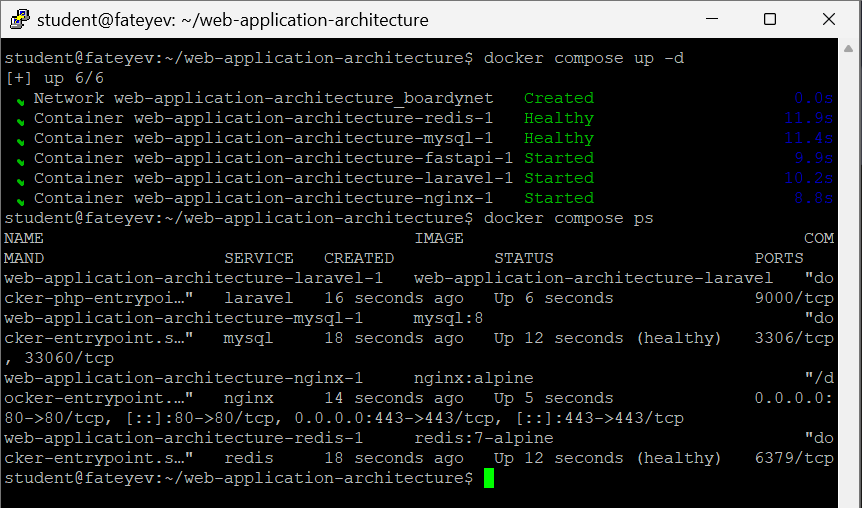

---

### Задание 15. Миграции в контейнере

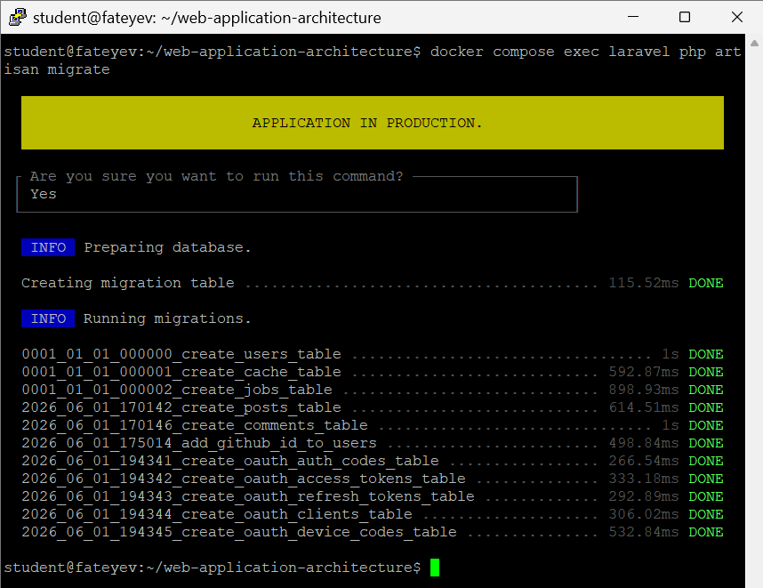  
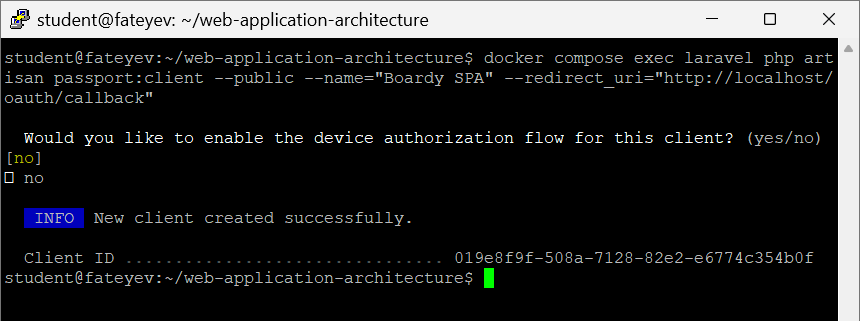

**Ответ:**  
`docker compose exec` запускает команду в уже работающем контейнере, сохраняя его окружение, файловую систему и подключённые сети; это похоже на интерактивный заход внутрь живого сервиса. `docker compose run` создаёт новый временный контейнер на основе образа, который может не иметь всех тех же томов, env-переменных и сетевых настроек, что основной сервис (если специально не указать). Для artisan-команд миграций и установки Passport обычно используют `exec`, чтобы гарантированно работать с тем же самым контейнером Laravel, который обслуживает запросы в стейджинге/проде.

---

### Задание 16. Приложение работает

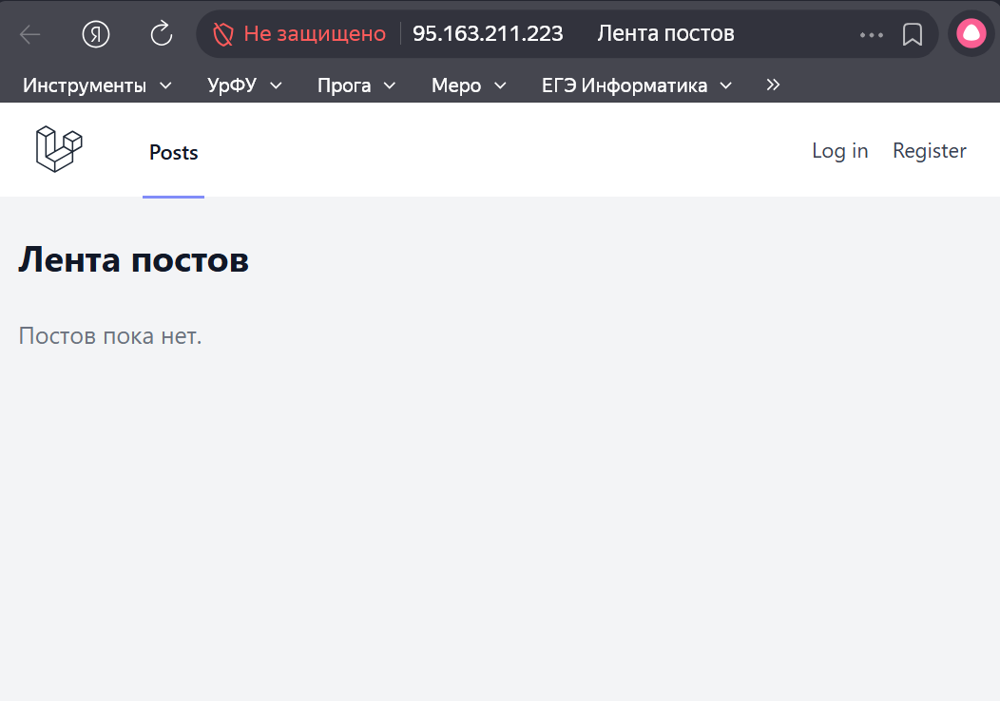  

---

### Задание 17. Реалтайм работает

  

---

### Задание 18. Данные переживают перезапуск

**Ответ:**  
При выполнении `docker compose down -v` Docker не только останавливает и удаляет контейнеры, но и удаляет все именованные volume, описанные в `docker-compose.yml`. Это означает полную потерю данных, которые хранились в MySQL, Redis или других сервисах, использующих эти volume: после следующего `up` базы будут пустыми, кэш — сброшен, файлы в томах — утрачены. Опасность флага `-v` в том, что его легко запустить по привычке для «чистки» окружения и тем самым случайно удалить важные данные, если нет отдельного бэкапа.

---

### Задание 19. Централизованные логи

**Ответ:**  
Централизованные логи Docker через `docker compose logs` позволяют смотреть вывод всех сервисов в одном потоке, с пометкой по имени контейнера, что упрощает трассировку запросов, проходящих через несколько сервисов (Nginx > Laravel > FastAPI > БД). Это удобнее, чем `tail -f /var/log/*` на хосте, где логи разложены по разным файлам и директориям, и приходится вручную переключаться между ними. Кроме того, Docker-логи автоматически собирают stdout/stderr из контейнеров независимо от того, где физически хранятся лог-файлы внутри, и одинаково работают на разных хостах и окружениях, что упрощает отладку и переносимость.

---