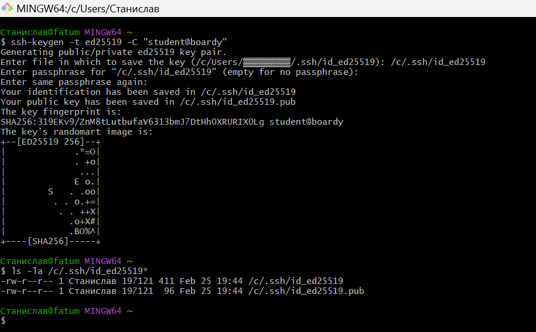
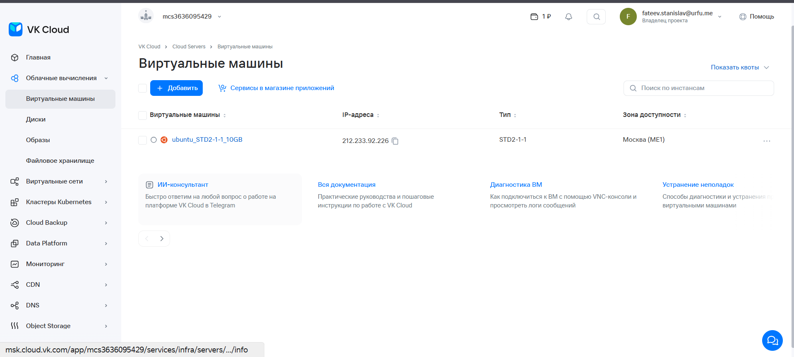
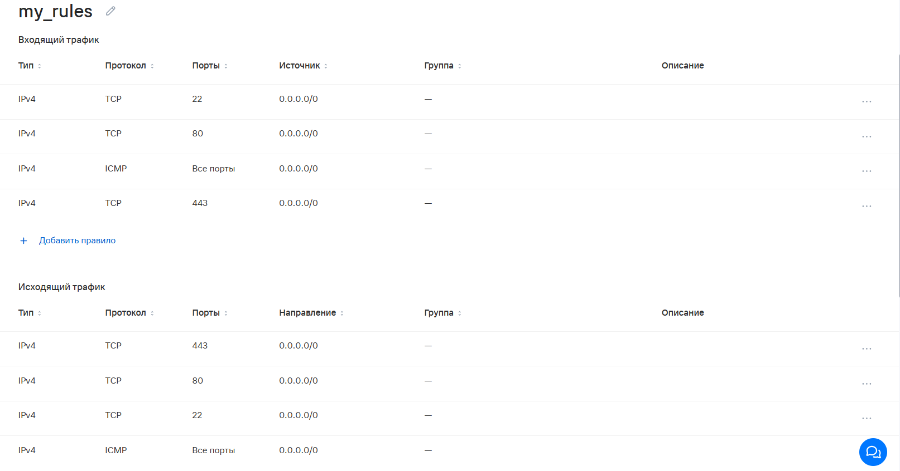
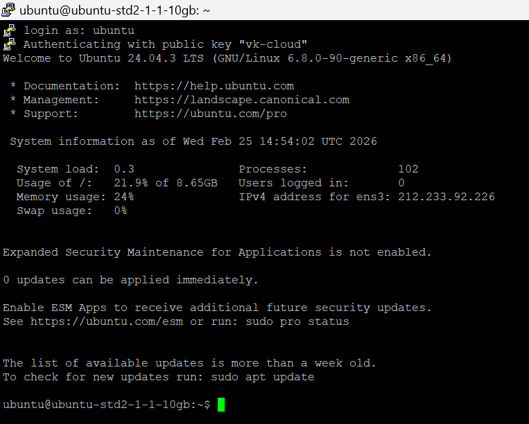
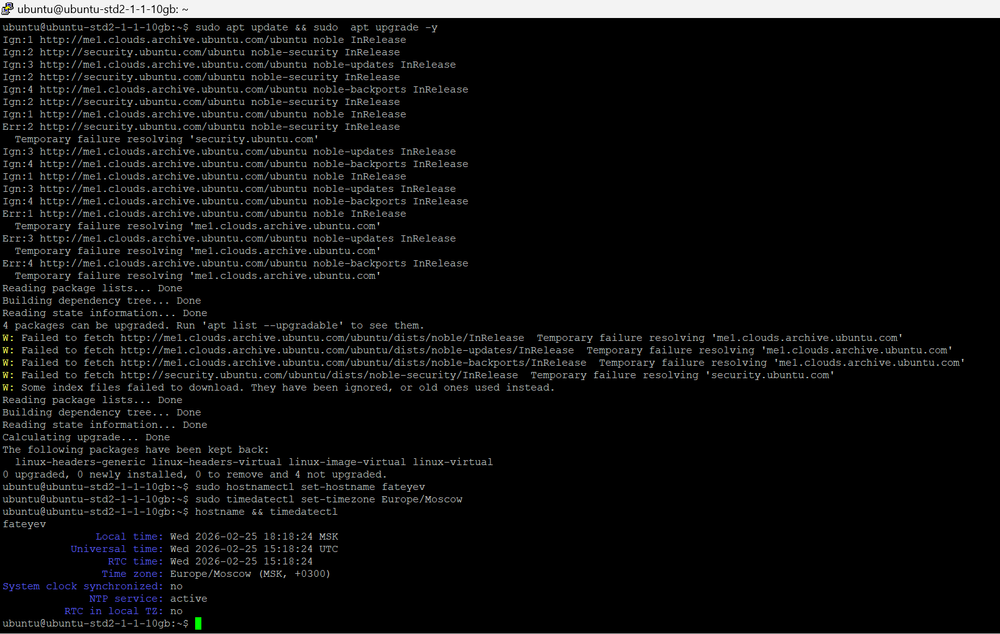
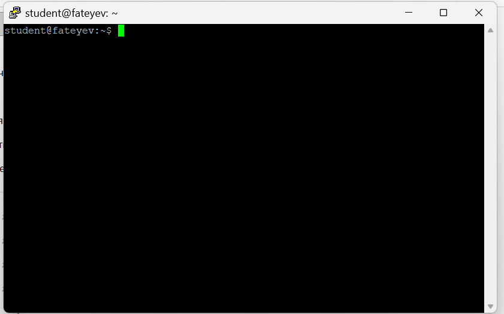
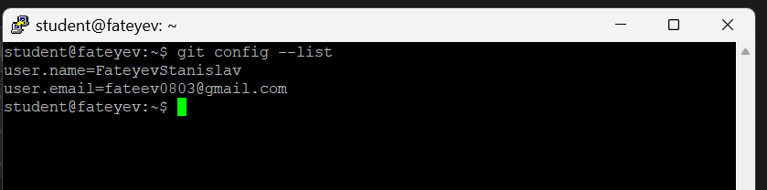
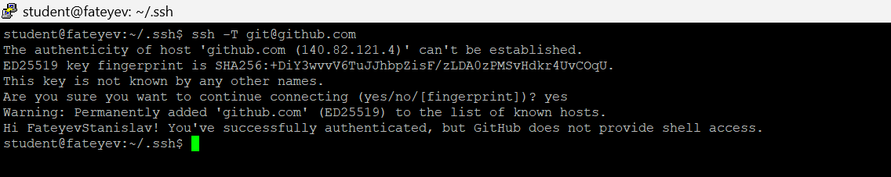
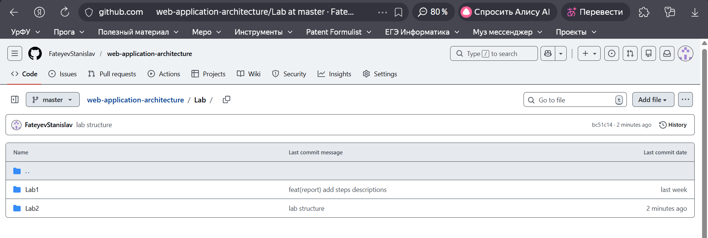

# Практическая работа №2: Развёртывание сервера и работа с Git

## 1. SSH-ключ
```
ssh-keygen -t ed25519 -C "student@boardy"
ls -la ~/.ssh/id_ed25519
```



## 2. VPS и файрвол
Создал VPS в VK Cloud (Ubuntu 22.04). Настроил файрвол: TCP 22, 80, 443 + ICMP (in/out).




## 3. Подключение через PuTTY
Подключился к VPS через PuTTY с SSH-ключом (.ppk).



## 4. Настройка сервера
```
sudo apt update && sudo apt upgrade -y
sudo hostnamectl set-hostname <fateyev>
sudo timedatectl set-timezone Europe/Moscow
hostname && timedatectl
```



## 5. Пользователь student
Создал пользователя student. Переподключился как student.



## 6. Git и SSH-ключ → GitHub
```
sudo apt install git -y
git config --global user.name "FateyevStanislav"
git config --global user.email "fateev0803@gmail.com"
git config --list
```
Добавил ключ из `~/.ssh/id_ed25519.pub` в GitHub.
```
ssh -T git@github.com
```




## 7. Репозиторий и структура
Склонировал репозиторий, создал структуру, запушил.


