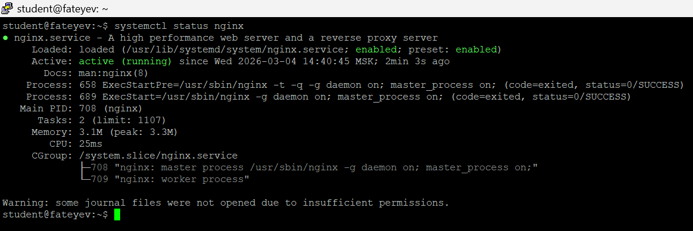
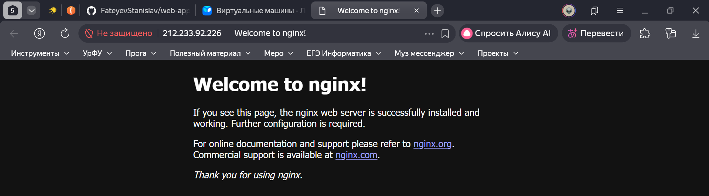
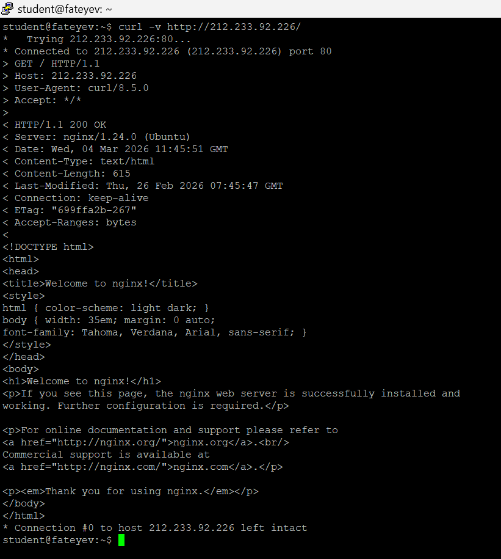
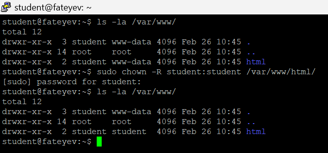
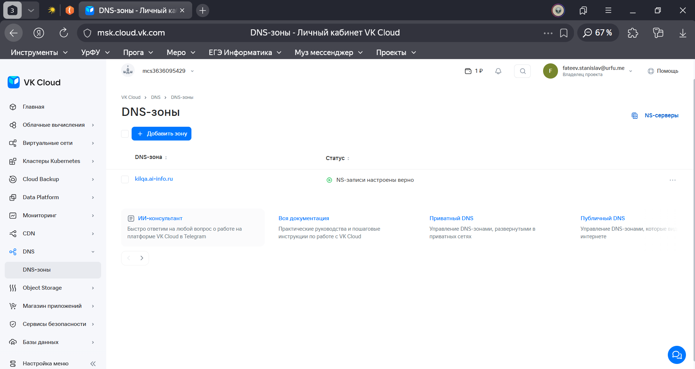
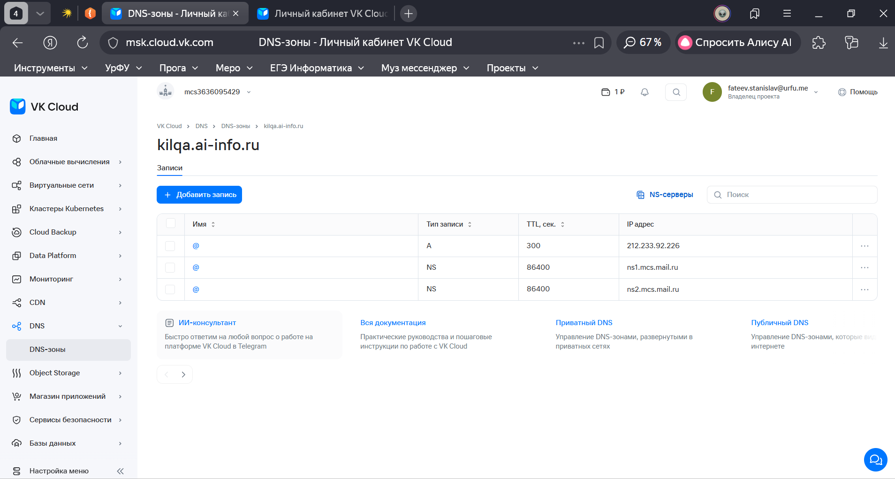
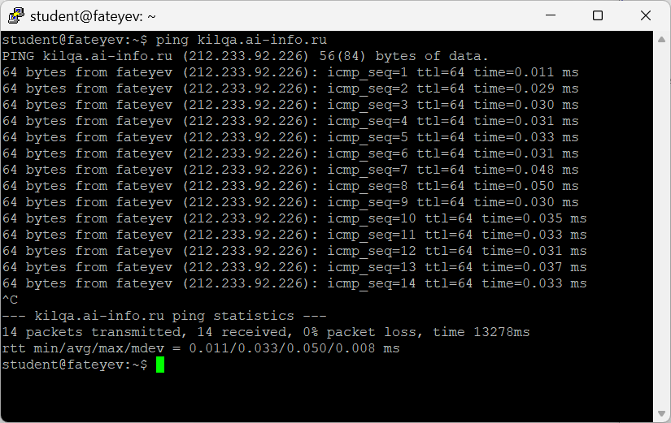
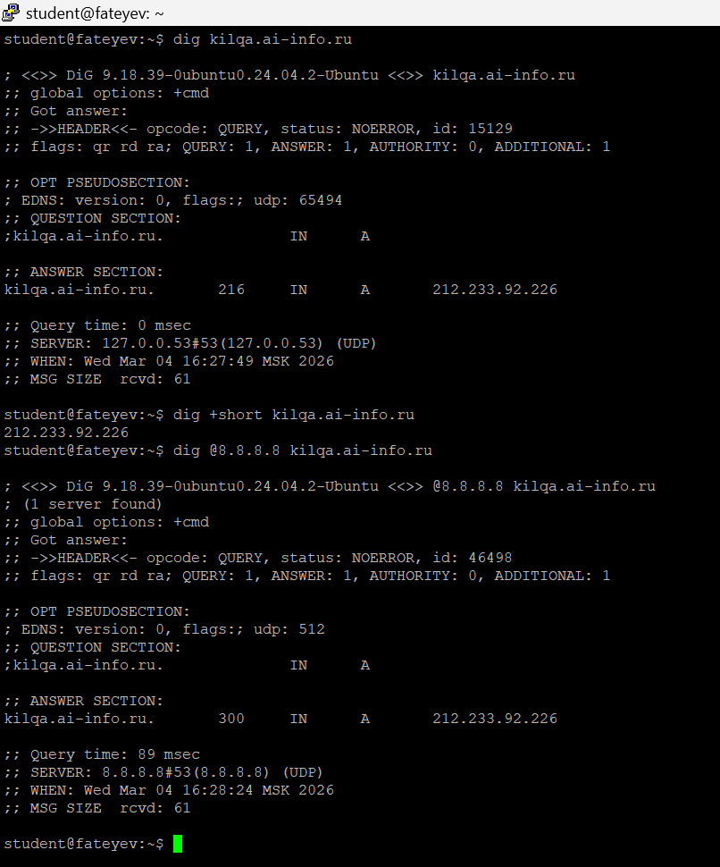
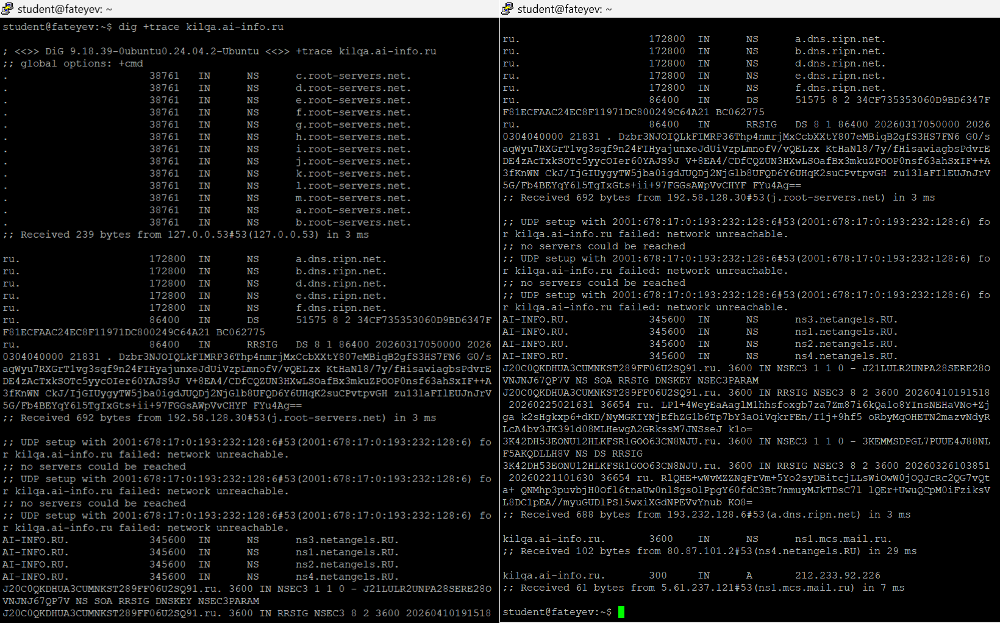
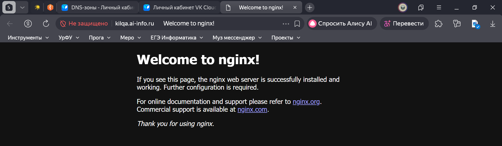

# Практическая работа №3: Установка nginx и настройка доменной зоны

## 1. Установка Nginx
```
sudo apt update && sudo apt install nginx -y
systemctl status nginx
```



## 2. Страница по IP



## 3. curl
```
curl -v http://212.233.92.226
```
Запрос GET / HTTP/1.1
Код ответа 200
Content-Type text/html



## 4. Директория и права
```
ls -la /var/www/
sudo chown -R student:student /var/www/html/
ls -la /var/www/
```



## 5. Конфигурация Nginx
```
cat /etc/nginx/sites-available/default
```
listen:
```
listen 80 default_server;
listen [::]:80 default_server;
```
Указывают, что сервер слушает входящие HTTP-запросы на порту 80 как для IPv4, так и для IPv6, и обрабатывает их как основной (default) сервер

root:
```
root /var/www/html;
```
Определяет корневую директорию веб-сервера, откуда Nginx берёт статические файлы для обслуживания

server_name:
```
server_name _;
```
Указывает имя сервера как универсальное — обрабатывает запросы, не подходящие под другие имена серверов

index:
```
index index.html index.htm index.nginx-debian.html;
```
Указывает список файлов по умолчанию, которые Nginx пытается отдать при запросе директории

## 6. DNS-зона



## 7. A-запись



## 8. ping
```
ping kilqa.ai-info.ru
```



## 9. dig
```
dig kilqa.ai-info.ru
```

QUESTION SECTION (что спросили): kilqa.ai-info.ru. IN A — запрос A-записи (IPv4-адрес) для домена kilqa.ai-info.ru.
​
ANSWER SECTION (IP + TTL): kilqa.ai-info.ru. 300 IN A 212.233.92.226 — IP-адрес 212.233.92.226 с временем жизни (TTL) 300 секунд.
​
SERVER (кто ответил): 127.0.0.53#53(127.0.0.53) — локальный DNS-резолвер системы



## 10. dig +trace
```
dig +trace фамилия.ai-info.ru
```



## 11. Сайт по домену


