# Практическая работа №4: HTTP, виртуальные хосты, проект Boardy

## Часть A. Виртуальный хост основного сайта

### 1. Директория проекта
```
sudo mkdir -p /var/www/boardy
sudo chown $USER:$USER /var/www/boardy
ls -la /var/www/
```

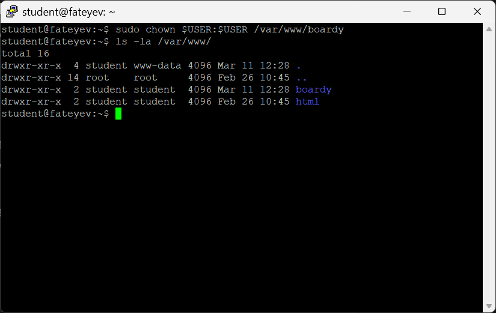

### 2. Конфиг виртуального хоста
**`/etc/nginx/sites-available/boardy`:**
```nginx
server {
    listen 80;
    listen [::]:80;
    
    server_name kilqa.ai-info.ru;
    root /var/www/boardy;
    index index.html;
    
    access_log /var/log/nginx/boardy-access.log;
    error_log /var/log/nginx/boardy-error.log;
    
    location / {
        try_files $uri $uri/ =404;
    }
    
    error_page 404 /404.html;
    location = /404.html {
        internal;
    }
}
```

Активация:
```
sudo ln -s /etc/nginx/sites-available/boardy /etc/nginx/sites-enabled/
sudo rm /etc/nginx/sites-enabled/default
sudo nginx -t && sudo systemctl reload nginx
```

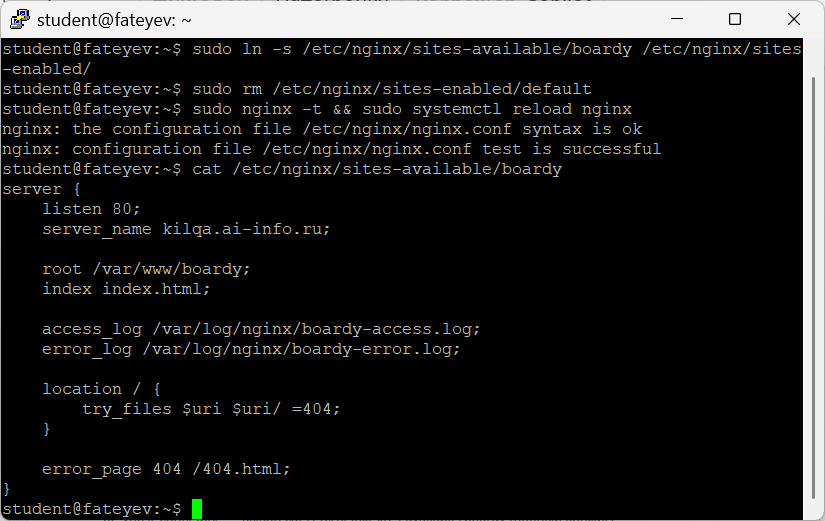

**Объяснение директив:**
- `server_name kilqa.ai-info.ru` — определяет доменное имя для обработки запросов этого виртуального хоста. [yamadharma.github](https://yamadharma.github.io/ru/post/2021/01/16/laboratory-work-structure/)
- `root /var/www/boardy` — корневая директория с файлами сайта.
- `access_log /var/log/nginx/boardy-access.log` — файл лога успешных запросов.
- `error_log /var/log/nginx/boardy-error.log` — файл лога ошибок.
- `try_files $uri $uri/ =404` — проверяет существование файла/директории, иначе 404.
- `error_page 404 /404.html` — подмена стандартной 404 на кастомную страницу.

## Часть B. Страницы проекта

### 3. Лендинг
**`/var/www/boardy/index.html`:**
```html
<!DOCTYPE html>
<html>
<head>
    <title>Boardy</title>
    <link rel="stylesheet" href="css/style.css">
</head>
<body>
    <h1>Boardy</h1>
    <p>Платформа для управления задачами и проектами</p>
    <a href="feedback.html">Обратная связь</a>
</body>
</html>
```

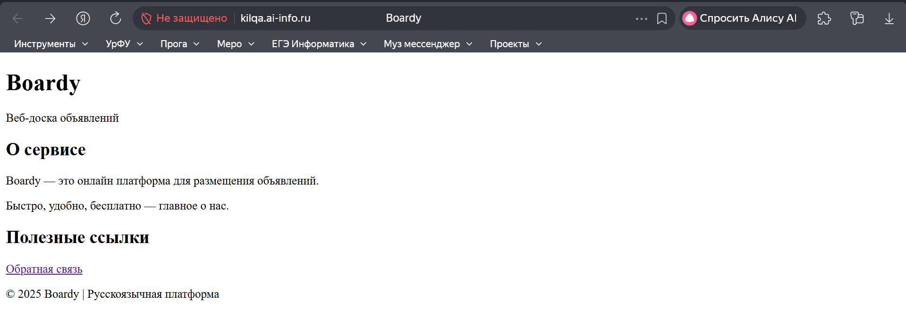

### 4. Форма обратной связи
**`/var/www/boardy/feedback.html`:**
```html
<!DOCTYPE html>
<html>
<head>
    <title>Boardy - Обратная связь</title>
    <link rel="stylesheet" href="css/style.css">
</head>
<body>
    <h1>Обратная связь</h1>
    <form method="POST" action="/submit">
        <input type="text" name="name" placeholder="Имя" required>
        <textarea name="message" placeholder="Сообщение" required></textarea>
        <button type="submit">Отправить</button>
    </form>
</body>
</html>
```

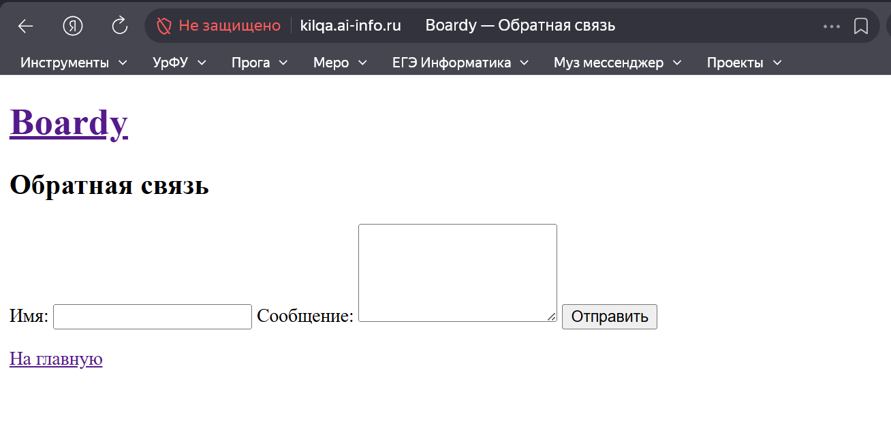

### 5. Стили и 404
**`/var/www/boardy/css/style.css`:**
```css
body { font-family: Arial; margin: 40px; }
h1 { color: #333; }
form { max-width: 400px; }
input, textarea { width: 100%; margin: 10px 0; padding: 10px; }
button { background: #007cba; color: white; padding: 10px 20px; border: none; }
```

**`/var/www/boardy/404.html`:**
```html
<!DOCTYPE html>
<html>
<head>
    <title>404 - Boardy</title>
    <link rel="stylesheet" href="css/style.css">
</head>
<body>
    <h1>404 - Страница не найдена</h1>
    <p>Запрашиваемая страница не существует.</p>
    <a href="/">На главную</a>
</body>
</html>
```

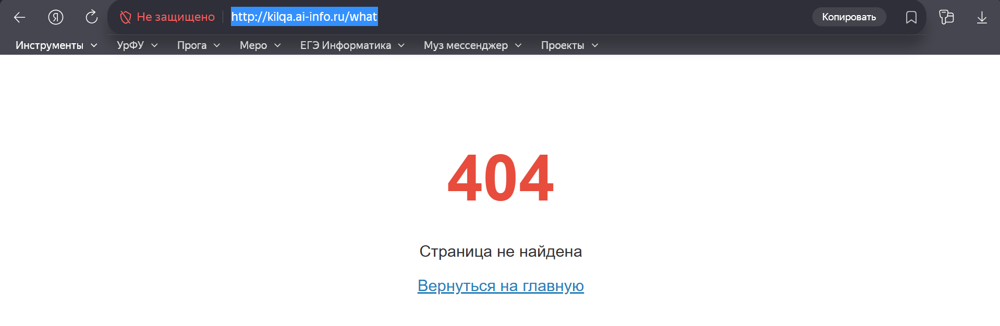

## Часть C. Второй виртуальный хост — API

### 6. DNS-запись для поддомена
A-запись: `api.kilqa.ai-info.ru → 212.233.92.226`

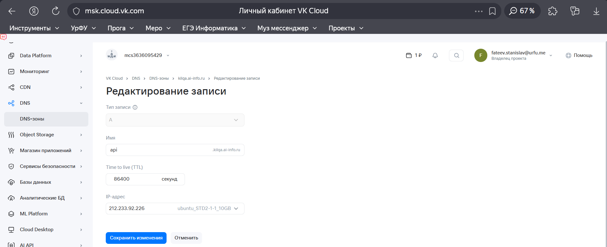

### 7. Проверка DNS
```
dig +short api.kilqa.ai-info.ru
212.233.92.226
dig @8.8.8.8 +short api.kilqa.ai-info.ru
212.233.92.226
```

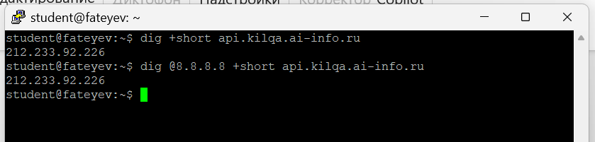

### 8. Конфиг и заглушка API
**`/var/www/boardy-api/index.html`:**
```html
<!DOCTYPE html>
<html>
<body>
    <h1>Boardy API</h1>
    <p>Service: OK</p>
</body>
</html>
```

**`/etc/nginx/sites-available/boardy-api`:**
```nginx
server {
    listen 80;
    listen [::]:80;
    
    server_name api.kilqa.ai-info.ru;
    root /var/www/boardy-api;
    index index.html;
    
    access_log /var/log/nginx/boardy-api-access.log;
    error_log /var/log/nginx/boardy-api-error.log;
    
    location / {
        try_files $uri $uri/ =404;
    }
}
```

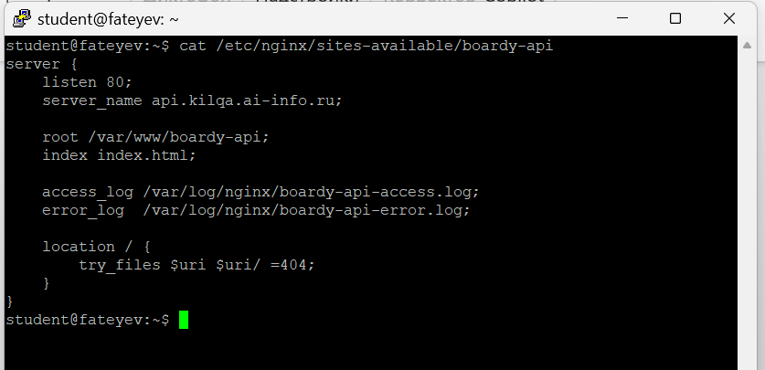

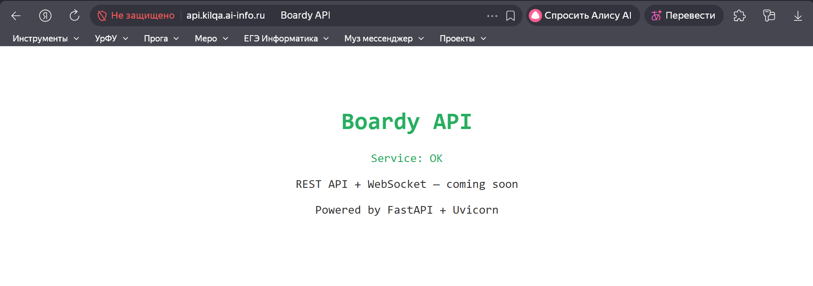

## Часть D. Исследование HTTP

### 9. GET-запрос через curl -v
```
curl -v http://kilqa.ai-info.ru/
```
**Запрос:** `GET / HTTP/1.1`, `Host: kilqa.ai-info.ru`  
**Ответ:** `HTTP/1.1 200 OK`, `Content-Type: text/html`, `Content-Length: 285`

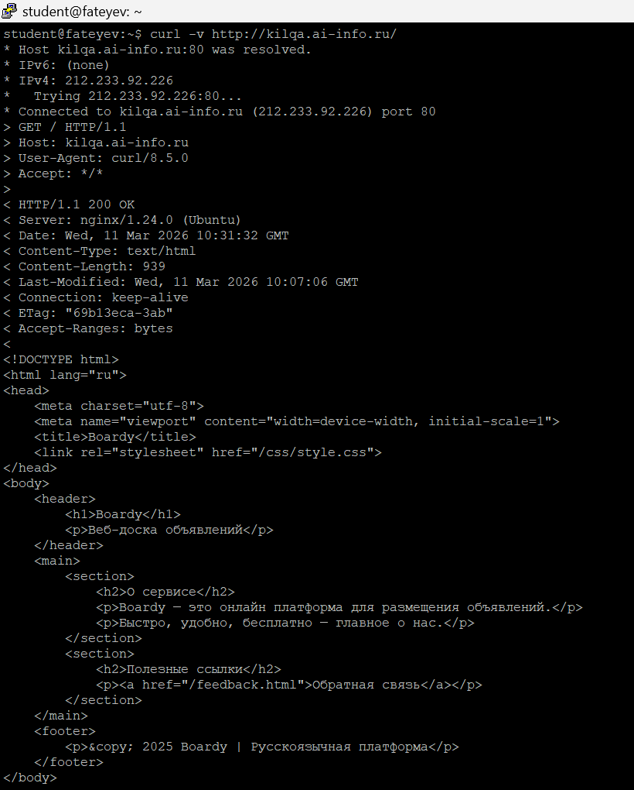

### 10. Виртуальные хосты в действии
```
curl -H "Host: kilqa.ai-info.ru" http://212.233.92.226/
curl -H "Host: api.kilqa.ai-info.ru" http://212.233.92.226/
curl -H "Host: unknown.ru" http://212.233.92.226/
```

**Объяснение:** Nginx выбирает виртуальный хост по заголовку `Host`. Один IP обслуживает разные сайты. `unknown.ru` → 404 (нет конфига).

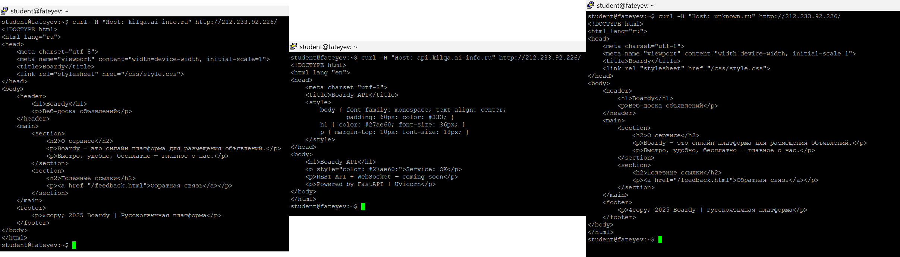

### 11. POST-запрос
```
curl -v -X POST -d "name=Ivanov&message=Hello" http://kilqa.ai-info.ru/submit
```
**Подписи:** `POST /submit HTTP/1.1`, `Content-Type: application/x-www-form-urlencoded`, тело `name=Ivanov&message=Hello`, `405 Method Not Allowed`.  
**Почему 405:** Nginx не настроен на обработку POST (нет `proxy_pass` или CGI).

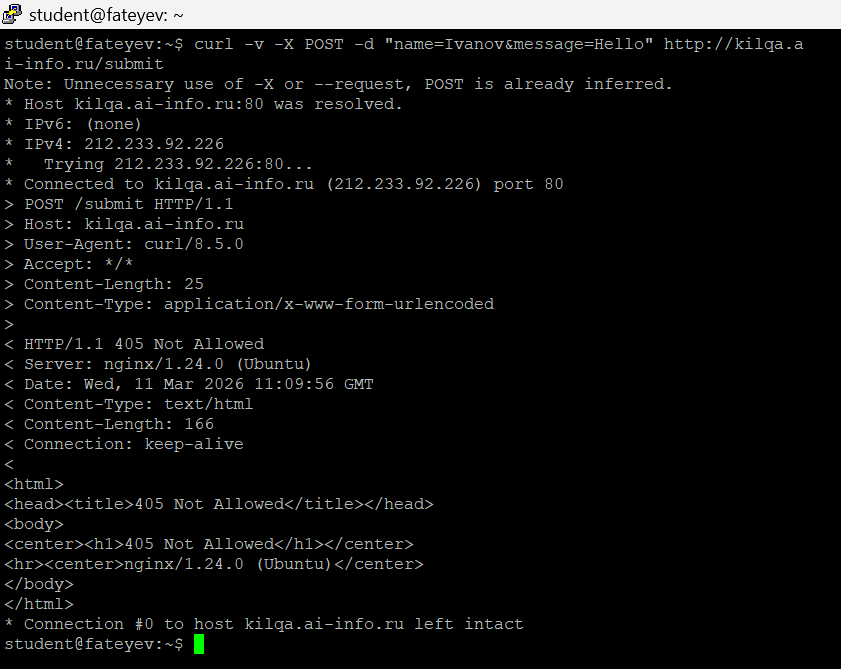

### 12. HEAD-запрос
```
curl -v http://kilqa.ai-info.ru/     # GET - заголовки + тело
curl -I http://kilqa.ai-info.ru/     # HEAD - только заголовки
```
**Отличие:** HEAD не возвращает тело ответа (Content-Length указывает размер).  
**Назначение:** Проверка доступности и метаданных без загрузки контента. [yamadharma.github](https://yamadharma.github.io/ru/post/2021/01/16/laboratory-work-structure/)

## Часть E. Логи

### 13. Раздельные логи
```
tail -5 /var/log/nginx/boardy-access.log
tail -5 /var/log/nginx/boardy-api-access.log
```
**Формат:** `IP - - [дата] "МЕТОД ПУТЬ HTTP/1.1" код размер "-" User-Agent`

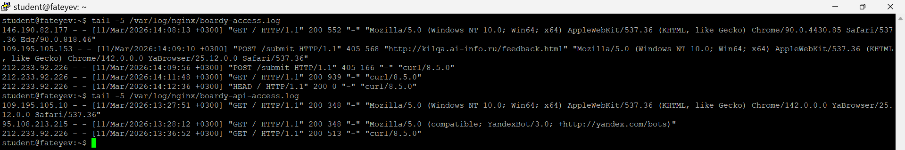

### 14. Фильтрация логов
```
awk '{print $9}' /var/log/nginx/boardy-access.log | sort | uniq -c | sort -rn
```

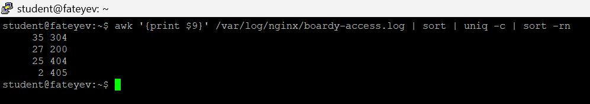
