# Практическая работа №5: Архитектура веб-приложений
## HTTPS для Boardy (kilqa.ai-info.ru)

### Часть A. HTTPS для основного сайта

#### Задание 1. Установка certbot
```
sudo apt install -y certbot python3-certbot-nginx
```

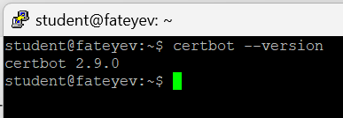

#### Задание 2. Получение сертификата
```
sudo certbot --nginx -d kilqa.ai-info.ru
```
**Certbot успешно получил сертификат Let's Encrypt и настроил Nginx для HTTPS.**

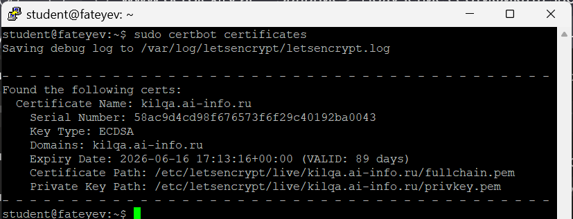

#### Задание 3. Проверка в браузере
HTTPS работает: `https://kilqa.ai-info.ru/` — зелёный замок в адресной строке.

**Информация о сертификате:**
- **Subject**: CN = kilqa.ai-info.ru
- **Issuer**: C = US, O = Let's Encrypt, CN = E7  
- **Срок действия**: 18 марта 2026 — 16 июня 2026 (90 дней)
- 
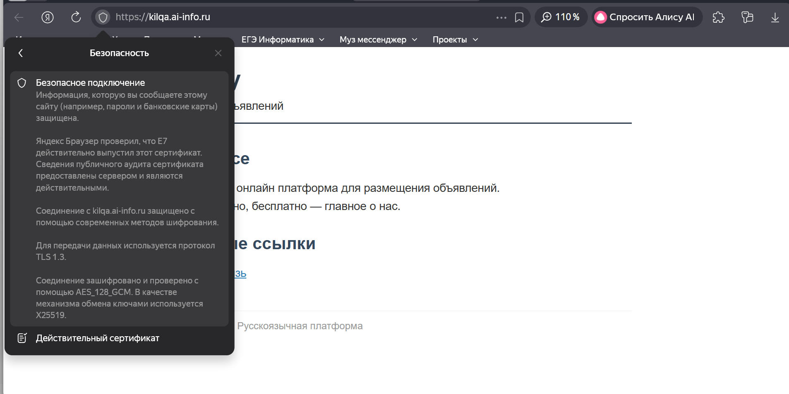
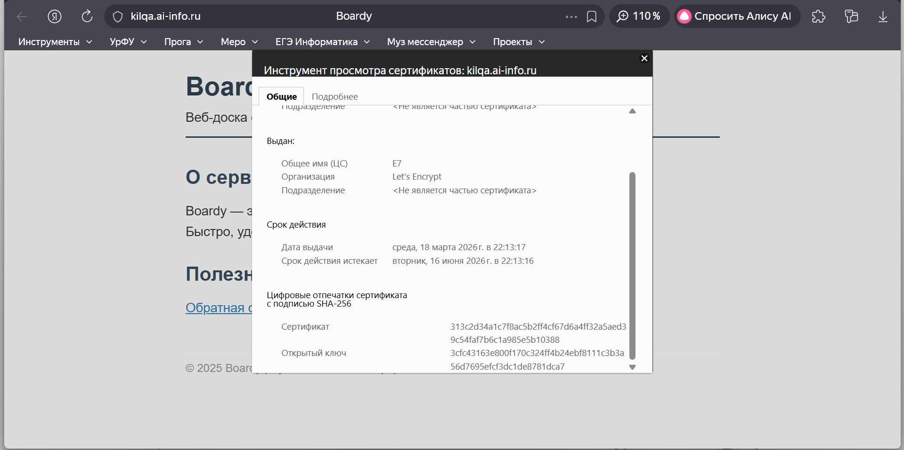

#### Задание 4. Редирект
```
curl -v http://kilqa.ai-info.ru/
```
```
< HTTP/1.1 301 Moved Permanently
< Location: https://kilqa.ai-info.ru/
```
**Код 301** — постоянный редирект с HTTP на HTTPS. **Заголовок Location** указывает новый HTTPS-адрес.

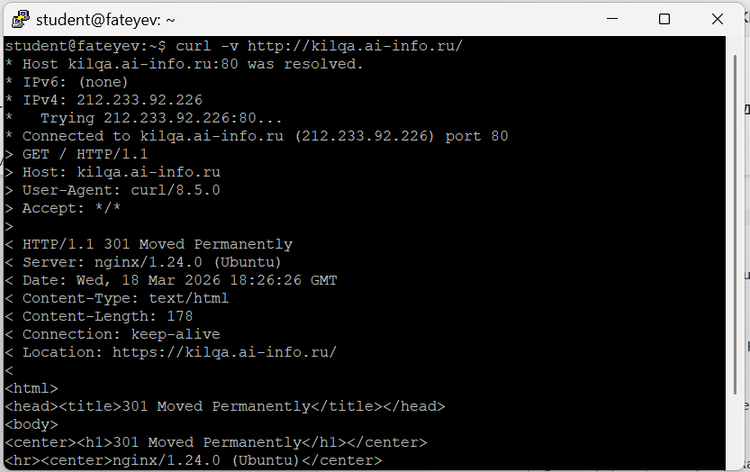

#### Задание 5. Конфиг после certbot
```
cat /etc/nginx/sites-available/boardy
```
**Добавленные Certbot строки:**
```
listen 443 ssl; # managed by Certbot
ssl_certificate /etc/letsencrypt/live/kilqa.ai-info.ru/fullchain.pem; # managed by Certbot
ssl_certificate_key /etc/letsencrypt/live/kilqa.ai-info.ru/privkey.pem; # managed by Certbot
include /etc/letsencrypt/options-ssl-nginx.conf; # managed by Certbot
ssl_dhparam /etc/letsencrypt/ssl-dhparams.pem; # managed by Certbot
```

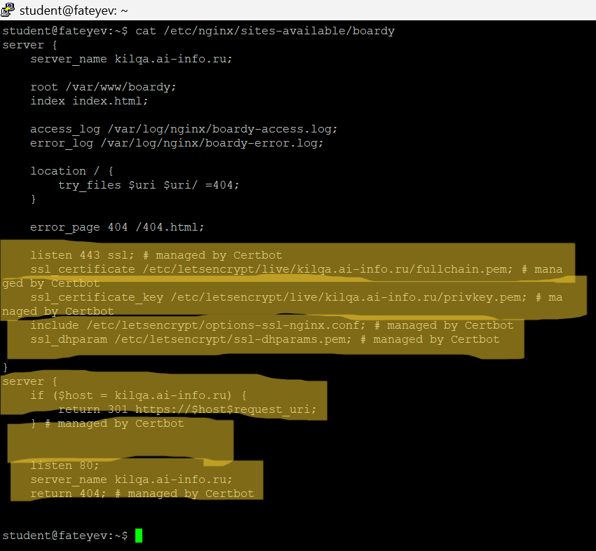

### Часть B. HTTPS для API-сервиса

#### Задание 6. Сертификат для api-поддомена
```
sudo certbot --nginx -d api.kilqa.ai-info.ru
```
**Успешно получен отдельный сертификат для API.**

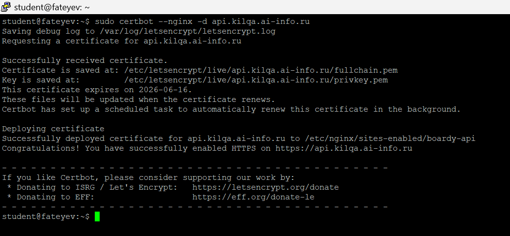

#### Задание 7. Проверка обоих доменов
```
curl -I https://kilqa.ai-info.ru/
curl -I https://api.kilqa.ai-info.ru/
```
**Оба домена возвращают HTTP/2 200 OK с SSL.**

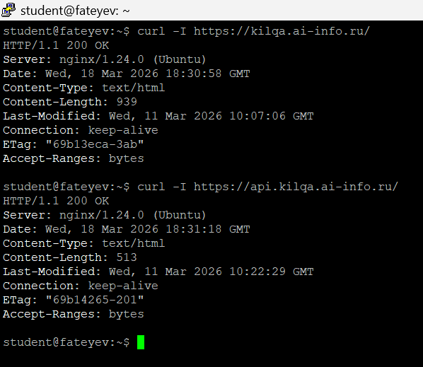

### Часть C. Разбор TLS

#### Задание 8. TLS handshake
```
curl -v https://kilqa.ai-info.ru/ 2>&1 | head -25
```
**Разбор:**
```
TLSv1.3 (OUT), Client hello (1)     ← Версия TLS: TLS 1.3
TLSv1.3 (IN), Server hello (2)      ← Сервер выбрал TLS 1.3
TLSv1.3 (IN), Certificate (11)      ← Сертификат kilqa.ai-info.ru
SSL connection using TLSv1.3 / TLS_AES_256_GCM_SHA384 ← Алгоритм: AES-256-GCM-SHA384
expire date: Jun 16 17:13:16 2026 GMT ← Срок действия
```

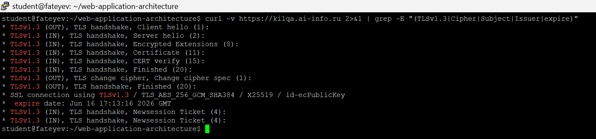

#### Задание 9. Цепочка доверия
```
echo | openssl s_client -connect kilqa.ai-info.ru:443 -showcerts 2>/dev/null | grep -E 's:|i:'
```
```
0 s:CN = kilqa.ai-info.ru
  i:C = US, O = Let's Encrypt, CN = E7
1 s:C = US, O = Let's Encrypt, CN = E7  
  i:C = US, O = Internet Security Research Group, CN = ISRG Root X1
```

**Цепочка:** ISRG Root X1 → E7 (Let's Encrypt) → kilqa.ai-info.ru  
**Проверка:** Браузер идёт от корневого CA (доверительного) вверх по цепочке, проверяя подписи.

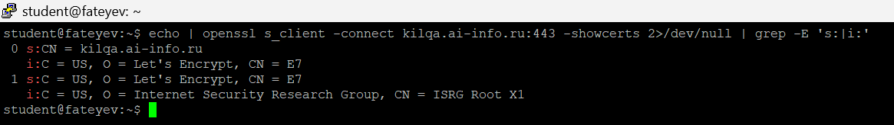

#### Задание 10. Сравнение сертификатов
```
kilqa.ai-info.ru:   subject=CN = kilqa.ai-info.ru, 16.06.2026
api.kilqa.ai-info.ru: subject=CN = api.kilqa.ai-info.ru, 16.06.2026
```
**Общее:** Один issuer (Let's Encrypt), одинаковый срок (90 дней).  
**Различия:** Разные subject (домен), разные serial numbers.

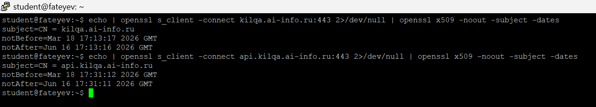

### Часть D. HSTS, кэширование, gzip

#### Задание 11. HSTS
**Добавлена строка:**
```
add_header Strict-Transport-Security "max-age=31536000" always;
```
**HSTS** заставляет браузер на год (31536000 сек) переходить только на HTTPS, защищая от MITM-атак (подмена сертификата).

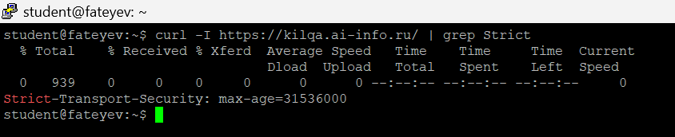

#### Задание 12. Кэширование и gzip
**Настроены заголовки Cache-Control для CSS и gzip-сжатие.**

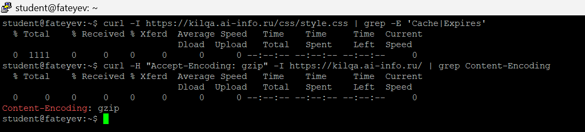

#### Задание 13. Автообновление
```
sudo certbot renew --dry-run
```

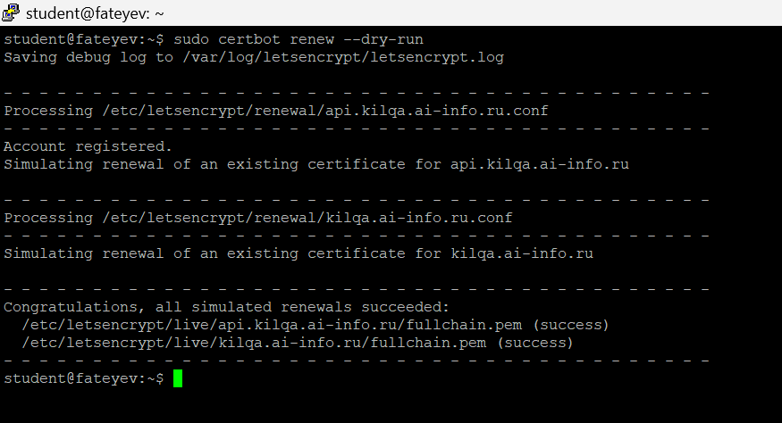
