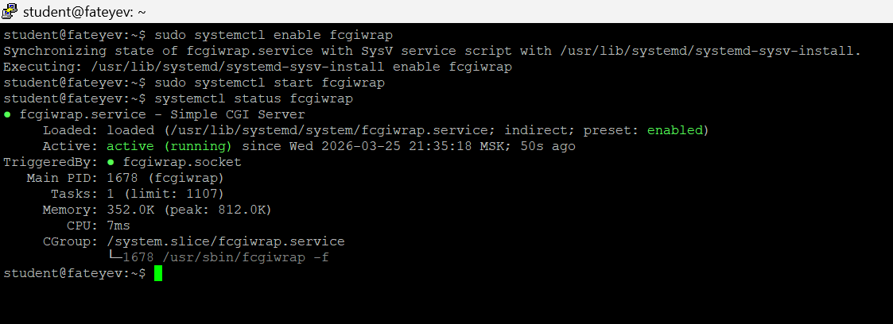
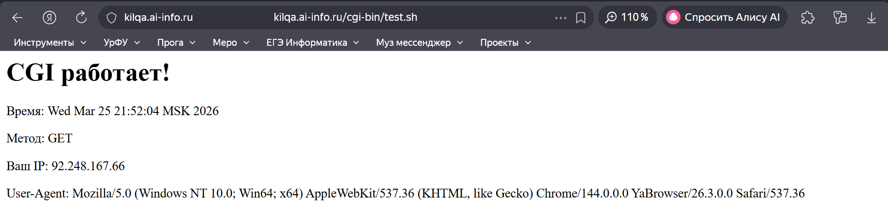
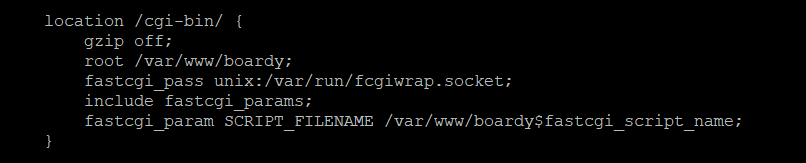
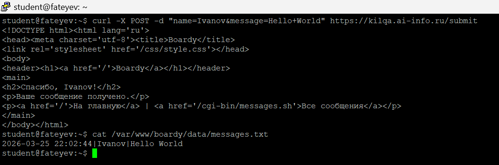
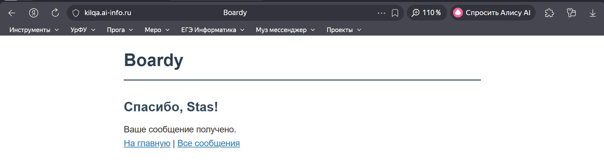
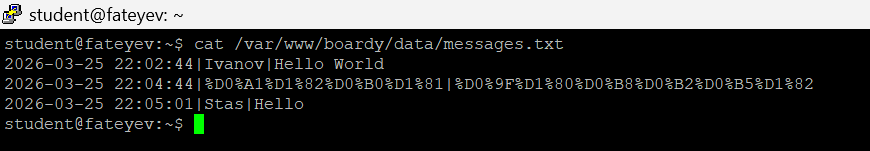
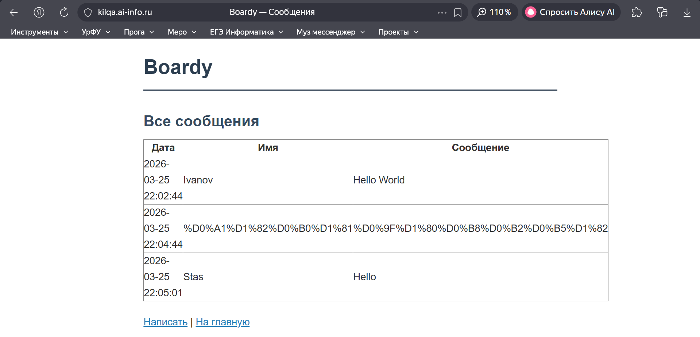
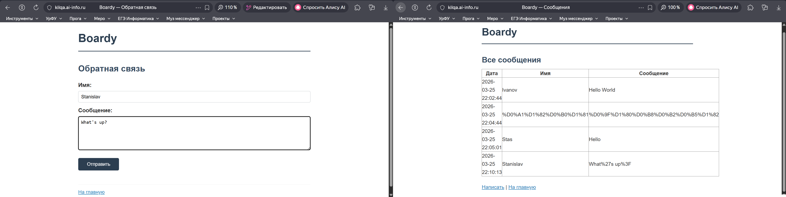

# Практическая работа №6: Архитектура веб-приложений
## CGI: Boardy оживает (kilqa.ai-info.ru)

### Часть A. CGI-скрипт

#### Задание 1. Установка fcgiwrap
```
sudo apt install -y fcgiwrap
ls -la /var/run/fcgiwrap.socket
```



#### Задание 2. Тестовый скрипт
Создан `/var/www/boardy/cgi-bin/test.sh` — выводит время, метод GET, IP, User-Agent.

  

#### Задание 3. Конфигурация Nginx
Добавлен блок `location /cgi-bin/` в `/etc/nginx/sites-available/boardy`.

**Объяснение строк:**
- `fastcgi_pass unix:/var/run/fcgiwrap.socket` — Nginx передает запрос fcgiwrap
- `include fastcgi_params` — добавляет CGI-переменные (REQUEST_METHOD, REMOTE_ADDR)
- `fastcgi_param SCRIPT_FILENAME /var/www/boardy$fastcgi_script_name` — путь к скрипту



### Часть B. Форма Boardy

#### Задание 4. Скрипт обработки формы
Создан `submit.sh`: читает POST-данные, сохраняет в `messages.txt`, возвращает «Спасибо!».

```
curl -X POST -d "name=Ivanov&message=Hello+World" https://kilqa.ai-info.ru/submit
```



#### Задание 5. Форма в браузере
Отправлена форма из `feedback.html`.



#### Задание 6. Данные на диске
```
cat /var/www/boardy/data/messages.txt
```



### Часть C. Страница сообщений

#### Задание 7. Скрипт вывода сообщений
Создан `messages.sh`: генерирует HTML-таблицу из `messages.txt`.



#### Задание 8. Полный цикл
Новое сообщение через форму → появилось в таблице сообщений.



### Часть D. Анализ

#### Задание 9. Путь запроса
```
Браузер (feedback.html POST) 
    ↓ HTTPS TLS 1.3
Nginx (:443, location = /submit)  
    ↓ fastcgi_pass
fcgiwrap (/var/run/fcgiwrap.socket) 
    ↓ exec bash
submit.sh (stdin ← POST_DATA) 
    ↓ парсинг sed
messages.txt (append)
    ↓ stdout HTML
fcgiwrap → Nginx → TLS → Браузер ("Спасибо!")
```

#### Задание 10. Теоретические вопросы
1. **CGI** — протокол взаимодействия веб-сервера с программами (1993). Решил проблему статических сайтов: позволил генерировать HTML динамически из stdin/stdout.
2. **POST-данные** через переменную `CONTENT_LENGTH` и `stdin` — скрипт читает `read -n $CONTENT_LENGTH POST_DATA`.
3. **Высокая нагрузка**: каждый запрос = новый процесс (fork+exec). 1000 одновременных = 1000 bash-процессов, сервер ляжет.
4. **`fastcgi_pass`** — передача в FastCGI-приложение (fcgiwrap). `proxy_pass` — HTTP-прокси в другой сервер (reverse proxy).
5. **fcgiwrap** — адаптер для Nginx (не поддерживает CGI нативно). Apache запускает CGI напрямую через mod_cgi.

### Pull Request
