## Часть A. MySQL — установка и настройка

### Задание 1. Установка MySQL
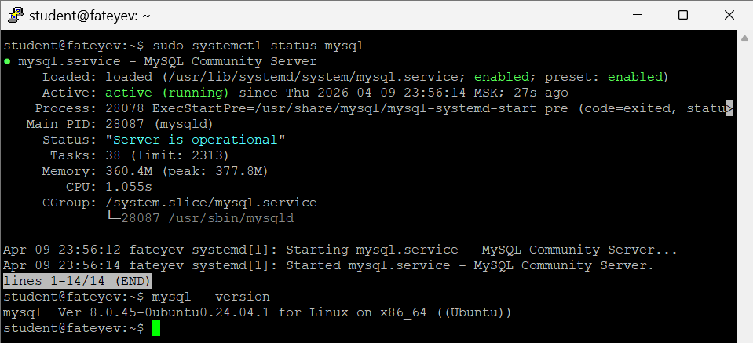

### Задание 2. База данных и пользователь
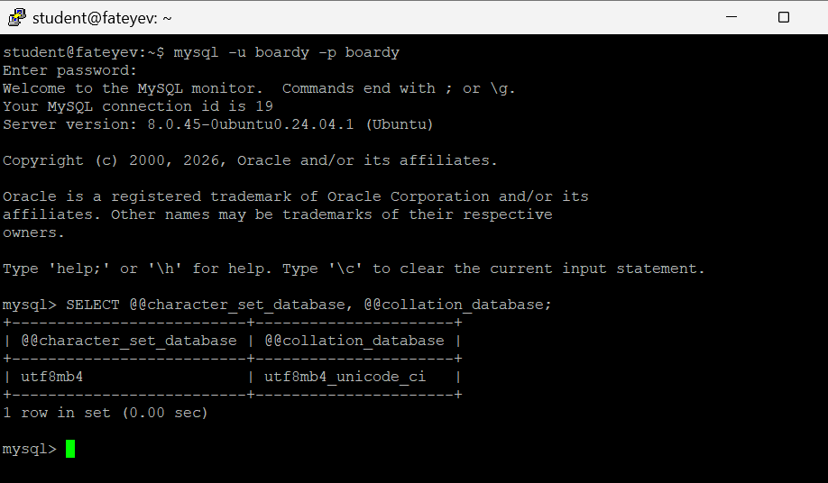

**Ответ:**  
`utf8mb4` нужен, потому что MySQL‑`utf8` поддерживает только до 3 байт на символ и не покрывает все Unicode (например, эмодзи); `utf8mb4` использует до 4 байт и полностью покрывает Unicode.  
Collation задаёт правила сравнения и сортировки строк; `utf8mb4_unicode_ci` даёт более точное Unicode‑согласованное сравнение, корректно работающее с мультиязычными текстами.

### Задание 3. phpMyAdmin
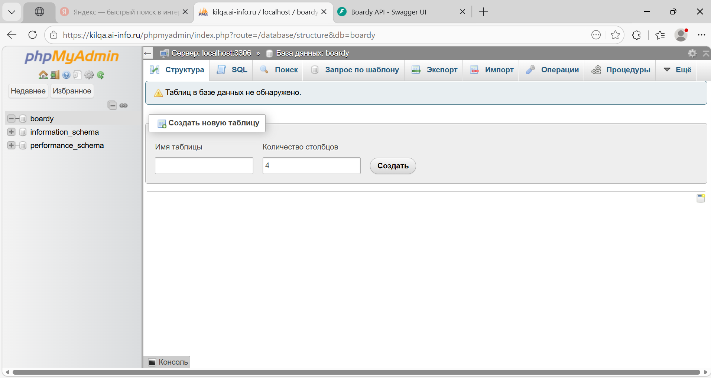

## Часть B. Таблицы и связи

### Задание 4. Три таблицы
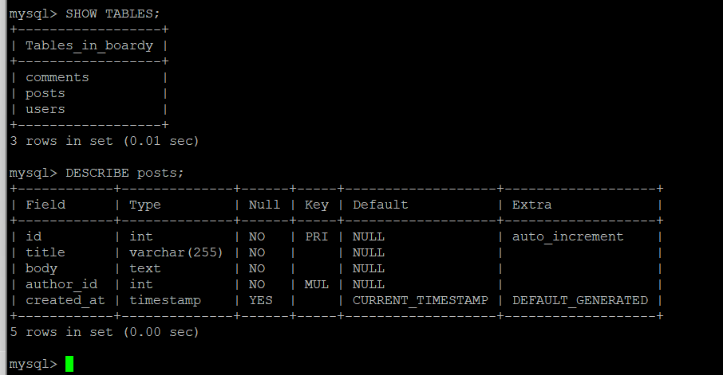  
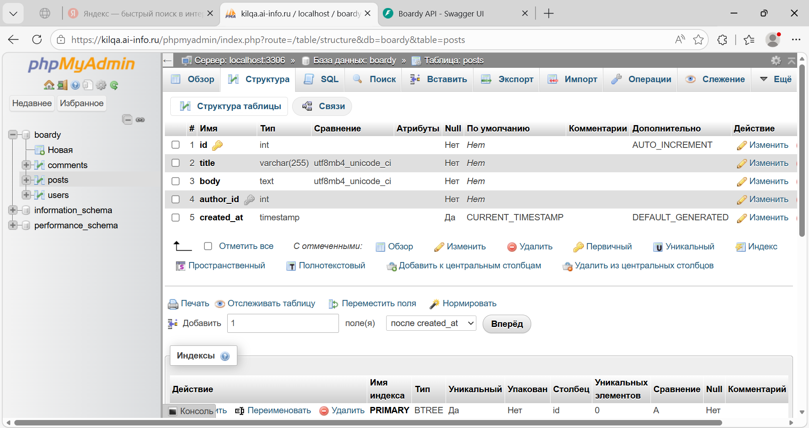

**Ответ:**  
`FOREIGN KEY` связывает колонку в дочерней таблице с первичным ключом родительской, обеспечивая ссылочную целостность (не может быть ссылки на несуществующую запись).  
`ON DELETE CASCADE` означает, что при удалении родителя автоматически удаляются все связанные дочерние записи, чтобы не оставалось «орфанных» строк.  
Используется движок InnoDB, потому что он поддерживает внешние ключи, `ON DELETE CASCADE`, транзакции и работу с целостностью данных.

### Задание 5. SQL‑скрипт
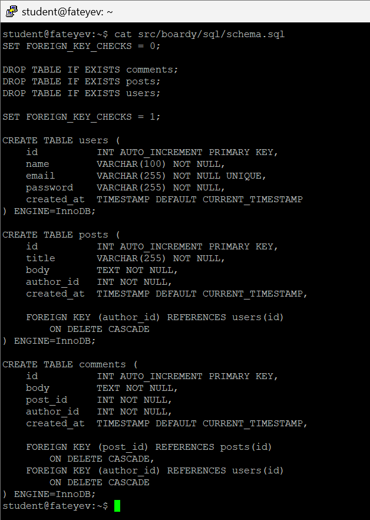

## Часть C. SQL — базовые операции

### Задание 6. INSERT
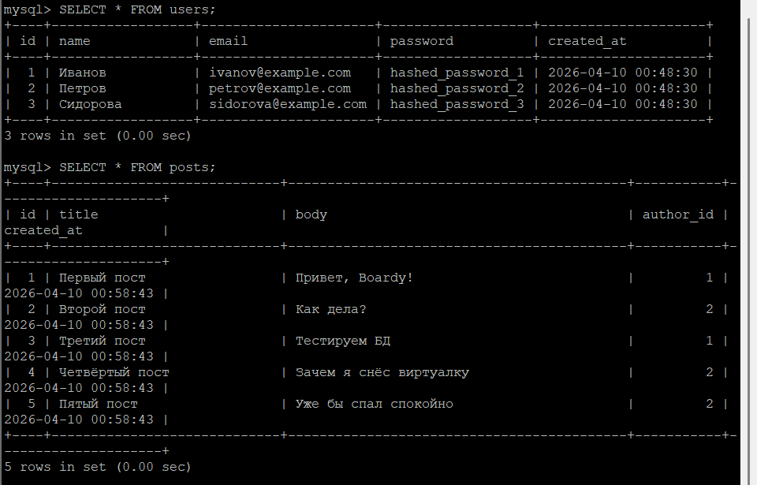  
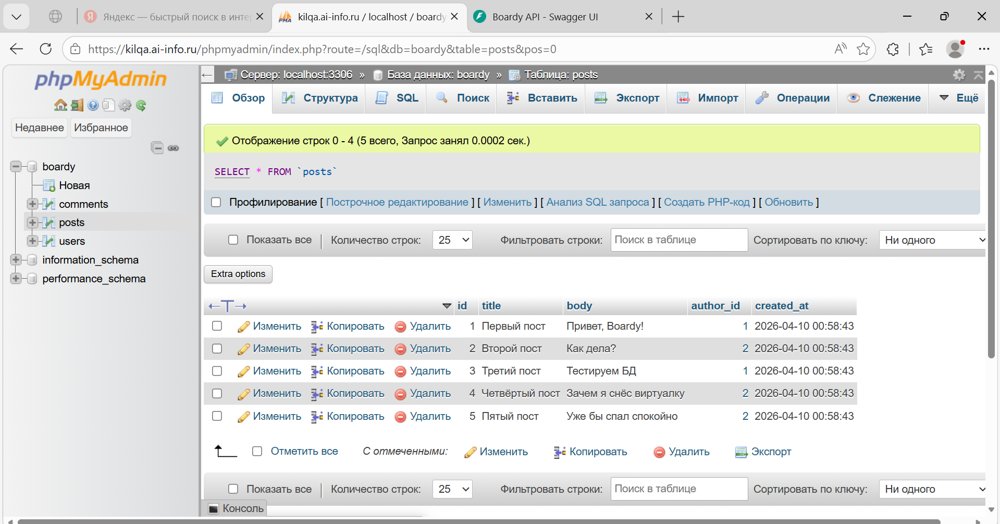

### Задание 7. SELECT + JOIN
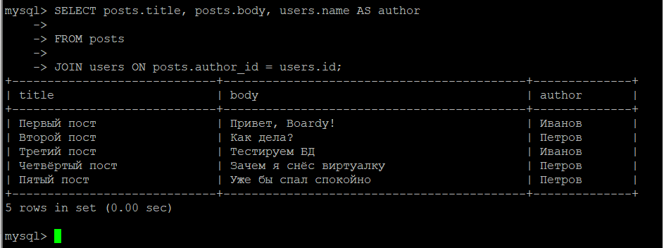

**Ответ:**  
`JOIN` нужен, чтобы за один запрос получить данные из связанных таблиц (например, пост + имя автора), а не делать много отдельных запросов к `users`.  
Без `JOIN` пришлось бы отдельно выбрать посты, затем в цикле для каждого `author_id` делать `SELECT` из `users`, что медленнее и создаёт больше запросов.

### Задание 8. Foreign Key — защита целостности
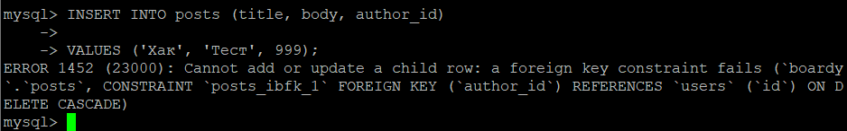

### Задание 9. CASCADE
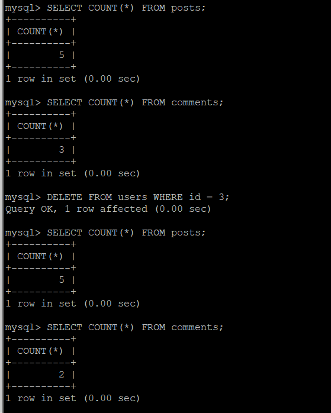

### Задание 10. SQL‑инъекция
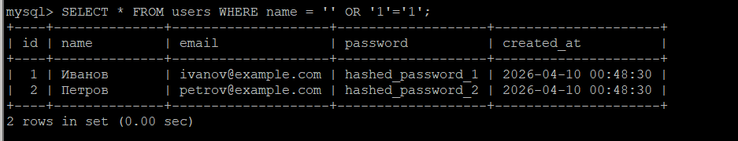

**Ответ:**  
SQL‑инъекция возникает, когда пользовательский ввод вставляется в SQL‑строку напрямую; злоумышленник может подставить условие (`'1'='1'`), которое делает выражение всегда истинным, и получает доступ ко всем строкам.  
`prepared statement` защищает, потому что SQL‑запрос компилируется заранее, а данные передаются отдельно как параметры; СУБД не интерпретирует их как часть SQL‑кода, поэтому злоумышленник не может изменить структуру запроса.

## Часть D. PHP + MySQL

### Задание 11. db.php
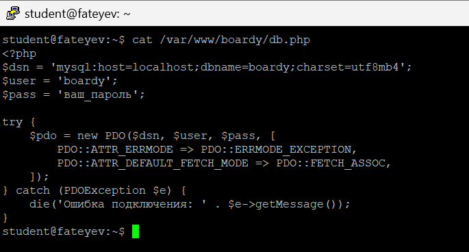

### Задание 12. submit.php через MySQL
  
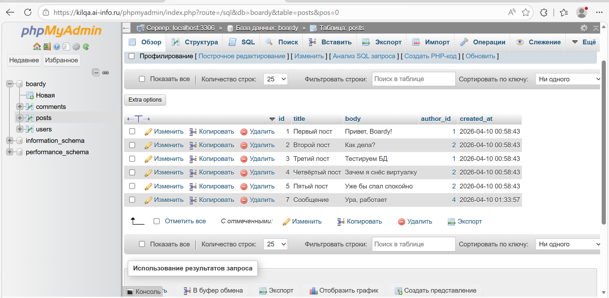

### Задание 13. messages.php через MySQL
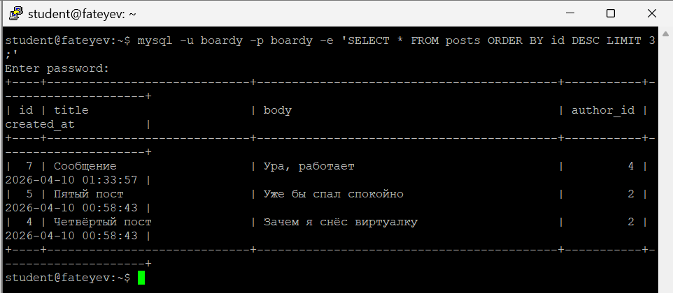

## Часть E. FastAPI + MySQL

### Задание 14. aiomysql
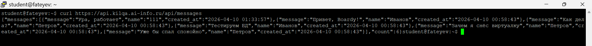  
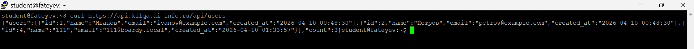

**Ответ:**  
`aiomysql` используется, потому что это асинхронный драйвер для MySQL, совместимый с Python‑`asyncio` и FastAPI; он не блокирует event loop при ожидании ответа от БД, позволяя обрабатывать другие запросы параллельно.  
С синхронным драйвером каждый запрос к MySQL блокировал бы event loop до получения ответа, и все остальные запросы к FastAPI пришлось бы выполнять последовательно, что убивает параллелизм и производительность.
