## Часть A. REST API

### Задание 1. Структура проекта
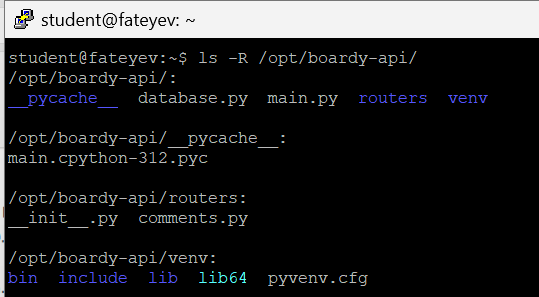

### Задание 2. GET — список комментариев
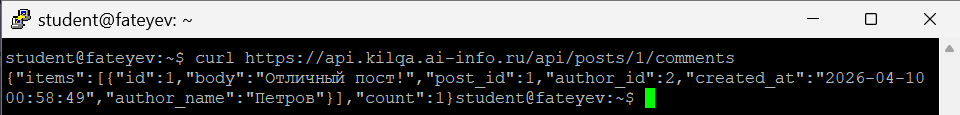

**Ответ:**  
Эндпоинт выполняет SQL-запрос вида:
```
SELECT c.id, c.body, c.created_at, u.name AS author_name
FROM comments c
JOIN users u ON c.author_id = u.id
WHERE c.post_id = %s
ORDER BY c.created_at;
```
`JOIN` нужен, чтобы за один запрос получить не только данные из таблицы `comments`, но и имя автора из таблицы `users`. Без `JOIN` пришлось бы отдельно читать комментарии, а потом для каждого `author_id` выполнять дополнительные запросы к `users`, что медленнее и сложнее.

### Задание 3. POST — создать комментарий
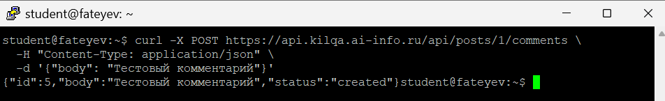

**Ответ:**  
Используется код `201 Created`, потому что запрос создаёт новый ресурс — новый комментарий, а не просто возвращает данные. Заголовок `Content-Type: application/json` означает, что тело HTTP-запроса отправлено в формате JSON, и сервер должен разобрать его именно как JSON.

### Задание 4. PUT — редактировать
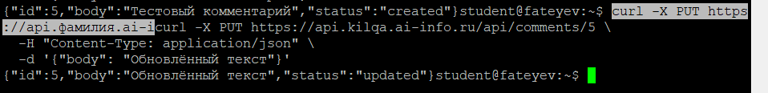

**Ответ:**  
`POST` обычно используется для создания новой записи, а `PUT` — для обновления уже существующей. URL отличается, потому что `/api/posts/{id}/comments` обращается к коллекции комментариев конкретного поста, а `/api/comments/{id}` — к одному конкретному комментарию, который мы редактируем по его собственному идентификатору.

### Задание 5. DELETE — удалить
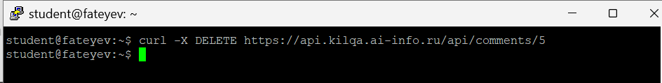

**Ответ:**  
В этой практике используются четыре HTTP-глагола: `GET`, `POST`, `PUT`, `DELETE`.  
`GET` возвращает `200 OK`, потому что успешно отдаёт данные; `POST` возвращает `201 Created`, потому что создаёт новый ресурс; `PUT` обычно возвращает `200 OK`, потому что успешно обновляет существующий ресурс; `DELETE` возвращает `204 No Content`, потому что удаление выполнено успешно и тело ответа не требуется.

### Задание 6. Ошибки
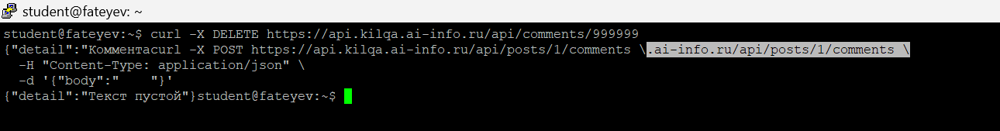

**Ответ:**  
`404 Not Found` означает, что запрошенный ресурс не существует, например комментарий с таким `id` не найден. `422 Unprocessable Entity` означает, что сам запрос синтаксически корректен, но данные не проходят валидацию, например поле `body` пустое или содержит только пробелы.

### Задание 7. Swagger
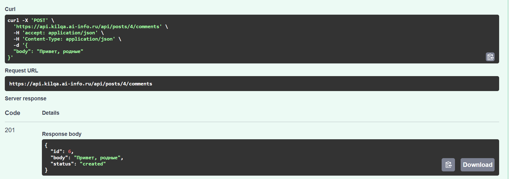


## Часть B. JavaScript-клиенты

### Задание 8. Vanilla JS — демо
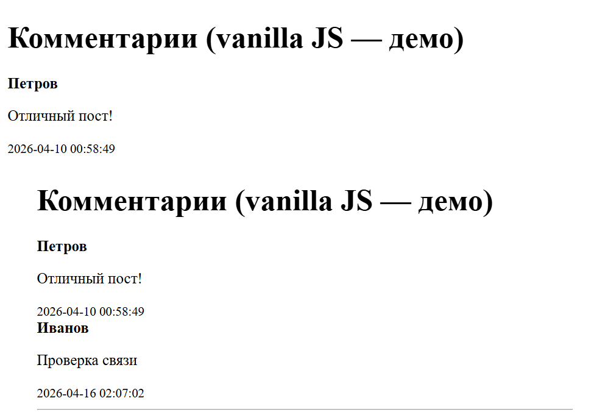

**Ответ:**  
Функция `esc()` экранирует пользовательский текст перед вставкой в HTML, чтобы символы `<`, `>`, `&` и другие не интерпретировались браузером как HTML-разметка. Если её не вызвать и вставить пользовательский ввод через `innerHTML`, злоумышленник сможет внедрить HTML или JavaScript-код, что приведёт к XSS-уязвимости.

### Задание 9. React — полный CRUD
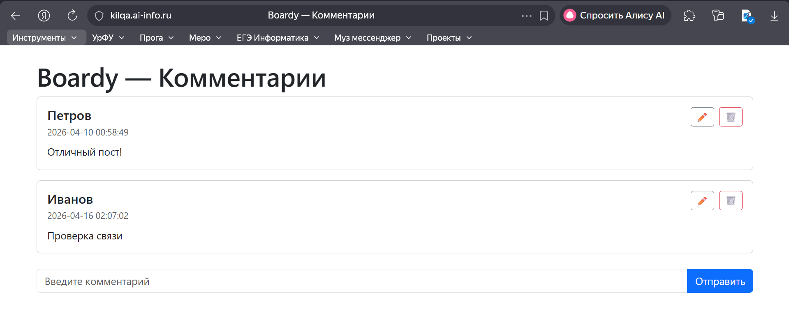  
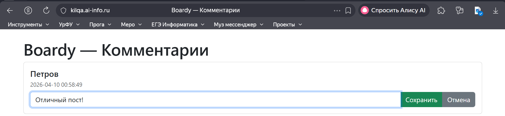  
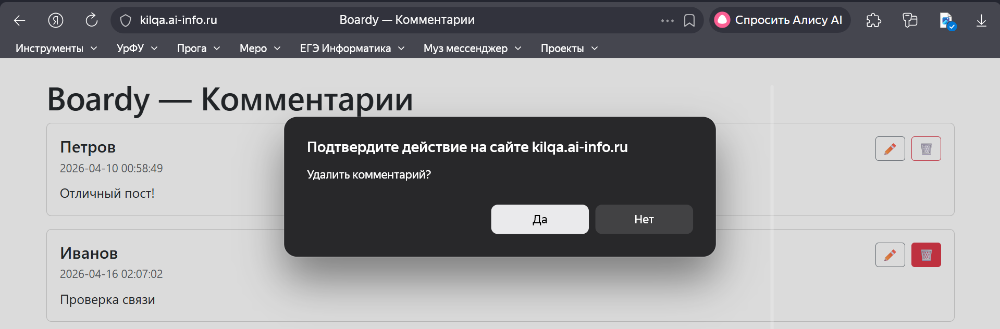

### Задание 10. Сравнение кода

**Ответ:**  
В vanilla JS состояние явно не хранится в отдельной структуре React-подобного типа: список комментариев и текст поля берутся из DOM и после действий страница просто заново запрашивает список и перерисовывает `innerHTML`. В React состояние хранится в `useState`: отдельно массив комментариев, отдельно текст новой формы, отдельно `editId` и `editText`.

После добавления в vanilla JS обычно снова вызывается функция загрузки списка и весь HTML перерисовывается заново через `innerHTML`. В React после успешного запроса тоже вызывается загрузка, но список хранится в состоянии компонента и React сам обновляет интерфейс после `setItems(...)`.

Редактирование в vanilla JS пришлось бы реализовывать ручной подменой DOM-элементов, созданием `input`, кнопок и обработчиков. В React редактирование сделано через условный рендер: если `editId === item.id`, показывается форма редактирования, иначе обычный текст комментария.

В vanilla JS защита от XSS реализуется вручную через `esc()` или `textContent`, а в React значения в JSX вроде `{item.body}` экранируются автоматически, поэтому стандартный вывод текста в React надёжнее по умолчанию.

### Задание 11. DevTools → Network
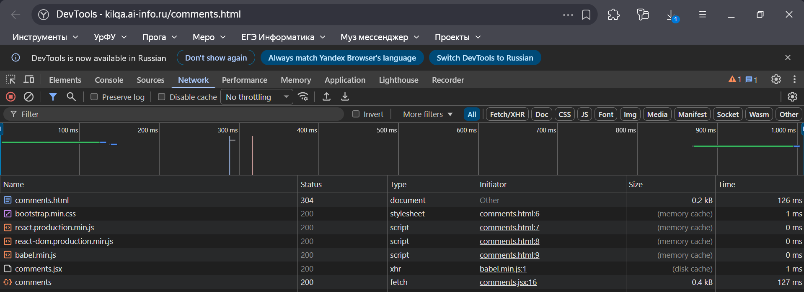

**Ответ:**  
При открытии `comments.html` браузер делает несколько запросов: сам HTML-файл, Bootstrap CSS, React, ReactDOM, Babel, `comments.jsx`, а также запрос к API за комментариями. Запросом к API является обращение вида `/api/posts/1/comments`, потому что именно он возвращает JSON с данными комментариев.


## Часть C. SSR vs CSR

### Задание 12. View Source
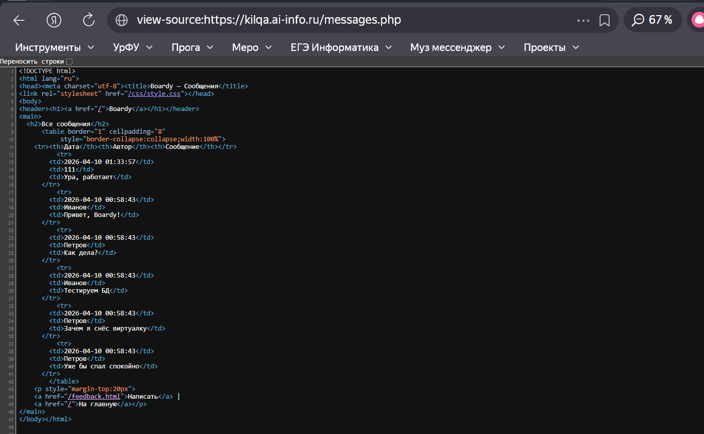  
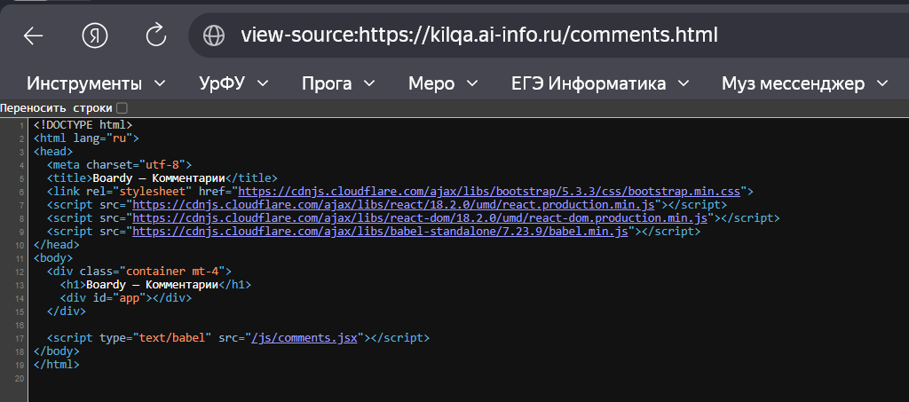

**Ответ:**  
В CSR нет данных в исходнике, потому что сервер отдаёт только HTML-шаблон и JavaScript, а сами данные подгружаются уже после загрузки страницы в браузере через API. Поисковый бот без выполнения JavaScript увидит в основном пустой контейнер приложения, например `<div id="app"></div>`, а не готовый список комментариев.

### Задание 13. XSS
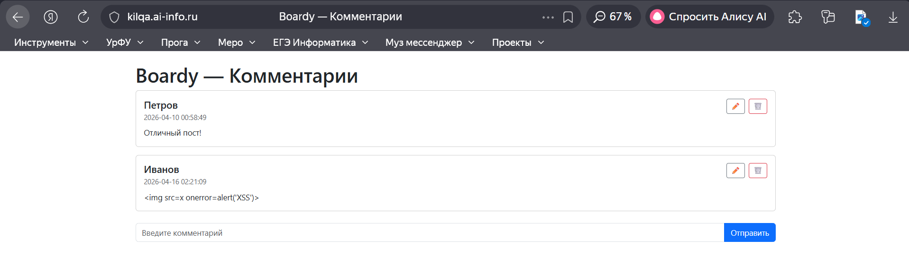

**Ответ:**  
В vanilla JS защита от XSS реализуется ручным экранированием пользовательского ввода, например через `textContent` внутри функции `esc()`, после чего строка вставляется безопасно как текст. В React защита встроена по умолчанию: значения, выводимые в JSX как `{item.body}`, автоматически экранируются и не исполняются как HTML или JavaScript.
Более надёжным является подход React, потому что защита встроена в стандартный механизм рендера компонентов. В vanilla JS безопасность зависит от внимательности разработчика: если забыть вызвать `esc()` или напрямую использовать `innerHTML`, можно получить XSS-уязвимость.

### Задание 14. Итоговая таблица

|  | SSR (PHP) | vanilla JS | React |
|---|---|---|---|
| Кто рендерит HTML | Серверный PHP-код рендерит HTML до отправки браузеру. | Браузерный JavaScript рендерит HTML после загрузки страницы. | React в браузере рендерит интерфейс на основе состояния компонента. |
| Формат ответа сервера | Готовый HTML. | HTML-шаблон + JSON от API. | HTML-шаблон + JSON от API. |
| View Source: данные видны? | Да, данные уже встроены в HTML-исходник. | Нет, исходник почти пустой, данные приходят позже через JS. | Нет, исходник содержит контейнер и скрипты, а не готовые данные. |
| Перезагрузка при отправке | Обычно да, если форма отправляется классически. | Нет, запрос идёт через `fetch()` без полной перезагрузки страницы. | Нет, запрос идёт через `fetch()`, интерфейс обновляется реактивно. |
| Защита от XSS | Обычно через серверное экранирование HTML при выводе. | Через ручное экранирование (`esc()`, `textContent`).| Автоматическое экранирование JSX-значений по умолчанию.|
| Сложность кода | Низкая для простого вывода, но хуже для интерактивности. | Средняя и быстро растёт даже на простых фичах. | Выше порог входа, но лучше масштабируется для CRUD и интерфейсного состояния. |
